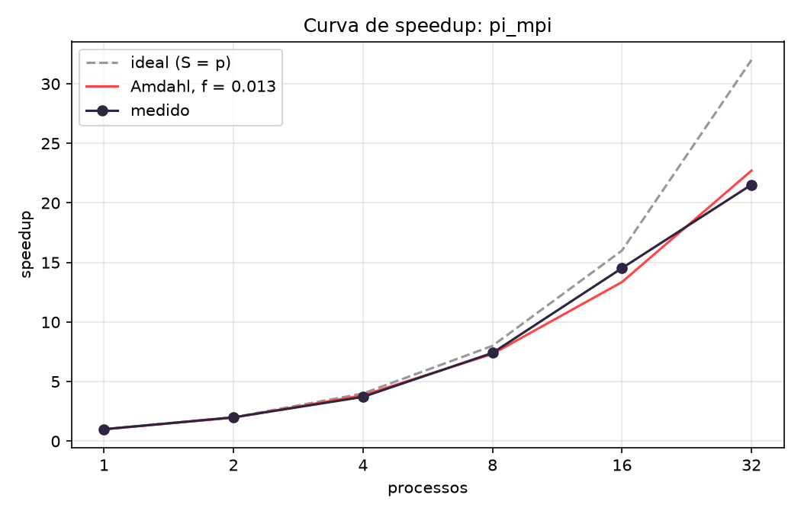

# Relatório — HPC Aula 3: MPI e Slurm

## Escopo e evidências

Entrega conferida com `Roteiro Aula 3 - MPI e SLURM.pdf`, Inteli 2026.2, Prof. João Luisi, especialmente os Blocos 2, 3 e 4 (páginas 4–7). Contém as tabelas e respostas dos Blocos 2 e 3, `resultados/speedup.csv` com seis pontos, gráfico, tabela de speedup e eficiência e as cinco respostas do experimento.

Os resultados foram recuperados de `/home/test/aula03-codigo`, em 30/09/2026. Os códigos, scripts e logs originais permanecem em [aula03/](aula03/). Foram usadas as execuções existentes; nenhum novo job foi submetido nesta organização. O cluster tem quatro nós (`c1`–`c4`), com quatro cores físicos e duas threads por core em cada nó: 16 cores físicos e 32 CPUs lógicas no conjunto.

## Bloco 2 — Ping-pong: o custo de uma mensagem

O [pingpong.c](aula03/pingpong.c) alterna `MPI_Send` e `MPI_Recv` entre dois ranks. O job 14 colocou ambos em `c1`; o job 15 colocou um em `c1` e outro em `c2`. A razão é o tempo entre nós dividido pelo tempo no mesmo nó.

| Tamanho | Mesmo nó: ida e volta (µs) | Nós diferentes: ida e volta (µs) | Razão |
| --- | ---: | ---: | ---: |
| 1 B | 0.25 | 199.07 | 796.280 |
| 1 KiB | 0.36 | 224.99 | 624.972 |
| 1 MiB | 124.68 | 19531.34 | 156.652 |

Fontes: [pingpong-14.out](aula03/pingpong-14.out), [pingpong-15.out](aula03/pingpong-15.out) e [tabela CSV](resultados/bloco2-pingpong.csv).

### Respostas do Bloco 2

**1. Para 1 byte, quantas vezes mais lenta é a mensagem que cruza o switch? Como se compara ao PCIe?** A ida e volta foi 796,28 vezes mais lenta (199,07 / 0,25). O valor medido é um round trip MPI, incluindo software e rede, e não a latência isolada do switch. A comparação numérica com PCIe depende da medição da Aula 1, que não está nas evidências recebidas; ela não foi inventada.

**2. Qual é a vazão para 1 MiB entre nós e quanto do gigabit foi aproveitado?** O log registra 107,4 MB/s, equivalentes a 859,2 Mbit/s: cerca de 85,92% do máximo nominal de 1 Gbit/s (125 MB/s). O cálculo do programa considera os bytes na ida e na volta. A vazão impressa de 0,0 MB/s para 1 byte é arredondamento, não ausência de comunicação.

**3. Dez mil mensagens de 1 byte ou dez mensagens de 1 MiB: qual termina antes e por quê?** Usando os tempos entre nós, dez mil ping-pongs de 1 byte levariam aproximadamente 1,991 s, e dez ping-pongs de 1 MiB, 0,195 s. As mensagens maiores amortizam o custo por troca e seriam mais rápidas nesse cenário. Há uma inconsistência no enunciado: 10.000 × 1 byte = 10.000 bytes, enquanto 10 × 1 MiB = 10.485.760 bytes; as quantidades não são iguais. Mesmo com essa diferença, a estimativa baseada nos logs favorece as dez mensagens grandes. Para um volume igual, agrupar mensagens pequenas também reduz a quantidade de custos fixos, respeitados os limites de memória e do protocolo.

## Bloco 3 — Soma com Bcast e Reduce

O [soma_reduce.c](aula03/soma_reduce.c) soma de 1 a N = 2.000.000.000. `MPI_Bcast` distribui N; cada rank soma sua fatia e `MPI_Reduce` agrega as parciais no rank 0. Todas as dez saídas terminaram com `OK`, e o total foi igual a `N(N+1)/2 = 2.000.000.001.000.000.000`.

A tabela registra **o tempo do rank 0**, solicitado pelo roteiro, e também o máximo entre os ranks. Foram preservadas as duas séries disponíveis.

| Job | Processos | Nós da alocação | Tempo do rank 0 (s) | Máximo entre ranks (s) | Validação |
| --- | ---: | --- | ---: | ---: | --- |
| 16 | 1 | c1 | 0.478 | 0.478 | OK |
| 17 | 2 | c2 | 0.478 | 0.478 | OK |
| 18 | 4 | c3 | 0.241 | 0.241 | OK |
| 19 | 8 | c4 | 0.129 | 0.129 | OK |
| 20 | 32 | c[1-4] | 0.032 | 0.033 | OK |
| 21 | 1 | c1 | 0.481 | 0.481 | OK |
| 22 | 2 | c2 | 0.477 | 0.478 | OK |
| 23 | 4 | c3 | 0.242 | 0.242 | OK |
| 24 | 8 | c4 | 0.129 | 0.129 | OK |
| 25 | 32 | c[1-4] | 0.032 | 0.032 | OK |

Fontes: logs `aula03/soma-16.out` a `aula03/soma-25.out` e [tabela CSV](resultados/bloco3-soma.csv). Esses tempos medem apenas o laço de soma, sem incluir `MPI_Bcast`, `MPI_Reduce` ou todo o ciclo do programa.

### Respostas do Bloco 3

**1. Quanto caiu o tempo do rank 0 de um para oito processos e de oito para 32?** Na primeira série, caiu de 0,478 s para 0,129 s, uma redução de 73,01% e aceleração de 3,705 vezes. De oito para 32, caiu de 0,129 s para 0,032 s, redução de 75,19% e aceleração de 4,031 vezes. Na segunda série, os valores foram 0,481 → 0,129 → 0,032 s, próximos dos primeiros. Com dois processos, o tempo permaneceu próximo ao de um; os logs não identificam a causa, que exigiria conferir afinidade, frequência e ocupação durante a execução.

**2. Em quantos nós o Slurm colocou 32 processos e por quê?** Nos jobs 20 e 25, a primeira linha registra `c[1-4]`: quatro nós. Cada nó disponibiliza oito CPUs lógicas, então os 32 processos ocupam a capacidade lógica dos quatro nós, conforme a configuração do cluster e as opções do job.

**3. Sem `MPI_Bcast`, o que fariam os ranks 1 a 31 com N?** N começa em zero e somente o rank 0 o recebe dos argumentos. Sem a difusão, os demais ranks conservariam N = 0, teriam uma fatia vazia e somariam zero. O total agregado deixaria de corresponder ao esperado, porque o rank 0 calcularia apenas sua própria fatia para a quantidade total de processos.

O mini desafio com `MPI_Allreduce` é opcional e não está documentado como executado nas evidências recuperadas.

## Bloco 4 — Curva de speedup em seis pontos

O [pi_mpi.c](aula03/pi_mpi.c) usa quatro bilhões de pontos Monte Carlo, com sementes por rank e reduções das contagens. O roteiro pede duas séries e o menor tempo de cada ponto. Foram identificadas as séries completas dos jobs 27–32 e 35–40, com as mesmas topologias de [speedup.sh](aula03/speedup.sh):

| Processos | Série 1: total (s) | Série 2: total (s) | Job escolhido pelo menor tempo |
| ---: | ---: | ---: | ---: |
| 1 | 34.8665 | 34.8664 | 35 |
| 2 | 17.4714 | 17.4564 | 36 |
| 4 | 9.3902 | 9.3931 | 29 |
| 8 | 4.7082 | 4.7093 | 30 |
| 16 | 2.4007 | 2.4013 | 31 |
| 32 | 1.6205 | 1.6198 | 40 |

O [resultados/speedup.csv](resultados/speedup.csv) contém um cabeçalho e exatamente seis linhas de dados. Cada linha mantém todas as colunas da execução que teve o menor `t_total`. O [CSV original](aula03/resultados/speedup-original.csv), com 15 medições, permanece intacto. Os jobs 26, 33 e 34 têm topologias adicionais e não foram misturados às duas séries principais.

### Tabela de speedup e eficiência

`S(p) = T(1)/T(p)` e `E(p) = S(p)/p`.

| Job | Processos | Nós | Total (s) | t_serial (s) | Cálculo máximo (s) | Speedup | Eficiência |
| --- | ---: | ---: | ---: | ---: | ---: | ---: | ---: |
| 35 | 1 | 1 | 34.8664 | 0.0000 | 34.8664 | 1.000 | 100.00% |
| 36 | 2 | 1 | 17.4564 | 0.0000 | 17.4564 | 1.997 | 99.87% |
| 29 | 4 | 1 | 9.3902 | 0.0000 | 9.3901 | 3.713 | 92.83% |
| 30 | 8 | 2 | 4.7082 | 0.0034 | 4.7048 | 7.405 | 92.57% |
| 31 | 16 | 4 | 2.4007 | 0.0065 | 2.3942 | 14.523 | 90.77% |
| 40 | 32 | 4 | 1.6198 | 0.0079 | 1.6119 | 21.525 | 67.27% |

Todos os pontos podem ser conferidos nos logs `aula03/resultados/pi-<job>.out`. A seleção e o cálculo usam os valores do CSV, com quatro casas decimais, em vez dos tempos arredondados a três casas no texto dos logs.

### Gráfico

O gráfico foi gerado pelo [script original](aula03/analisa_speedup.py), com eixo x em log base 2 e as três linhas exigidas: ideal, Amdahl e medido. O ajuste estima `f ≈ 0.01320` (1.32%) e limite assintótico `1/f ≈ 75.8`. É uma estimativa efetiva para estes dados, não uma garantia de desempenho em outro tamanho de cluster.

**Nota de medição:** apesar da descrição de arranque no roteiro, o código inicia o cronômetro depois de `MPI_Init` e da barreira inicial. `t_serial = t_total - t_calc_max` inclui custos e diferenças entre essa janela e o cálculo máximo; não mede a inicialização MPI completa nem o tempo na fila Slurm. Valores impressos como 0,0000 s podem representar tempos pequenos arredondados.

### As cinco respostas do experimento

**1. Onde a curva dobra? Em que ponto a eficiência cai abaixo de 70%? O que aconteceu no hardware nesse ponto?** A perda de escalabilidade fica mais evidente ao passar de 16 para 32 processos: a eficiência cai de 90.77% para 67.27%, ficando abaixo de 70% no ponto de 32. São 16 cores físicos no cluster; 32 processos passam a usar duas threads por core, compartilhando recursos físicos. O resultado é compatível com um ganho menor por SMT, embora a medição não isole esse efeito de frequência, comunicação e outros custos.

**2. De 16 para 32, quanto se ganhou? Como isso se relaciona a cores e threads? O que é SMT?** O tempo cai de 2.4007 s para 1.6198 s: ganho de 1.482 vez, redução de 32.53% no tempo, em vez do ganho ideal de duas vezes. Cada nó tem quatro cores físicos e oito threads lógicas. SMT permite que um core execute mais de uma thread de hardware compartilhando suas unidades de execução; ele não duplica o número de cores físicos.

**3. Qual é a fração serial segundo o ajuste? `t_serial` cresce com os processos? Por quê?** O ajuste estima `f ≈ 0.01320`, cerca de 1.32%. Na seleção dos seis pontos, `t_serial` é 0,0000 s com um, dois e quatro processos, depois cresce para 0,0034 s com oito, 0,0065 s com 16 e 0,0079 s com 32. Há mais participantes nas coletivas e comunicação entre nós, aumentando custos de coordenação e redução. O programa executa duas chamadas de `MPI_Reduce`, além do `MPI_Bcast`; seu resíduo também pode refletir diferenças de sincronização. A fração efetiva do ajuste não equivale diretamente à razão `t_serial/t_total`.

**4. Amdahl acertou? Compare o S(32) previsto com o medido e dê uma hipótese.** Com esse ajuste, Amdahl prevê `S(32) ≈ 22.708`, enquanto o medido é `21.525`. O medido fica 5.21% abaixo da previsão. Amdahl aproxima a tendência, mas assume uma fração serial constante e ganho ideal na parcela paralela; aos 32 processos, o uso de SMT compartilha recursos de cores já ocupados. Essa é uma hipótese coerente para a divergência, junto com custos de coletivas e eventual desbalanceamento. Como o ajuste usa os mesmos seis pontos, esta comparação avalia aderência à curva observada, não uma previsão independente.

**5. Se cada rank lesse sua fatia de um arquivo de 200 MB no NFS antes de calcular, o que mudaria? E com 50 mil contratos em PDF?** Surgiria uma etapa de I/O compartilhado: os ranks competiriam pela rede e pelo servidor NFS, e a vazão agregada imporia um limite ao ganho de adicionar processos. Para fatias sem sobreposição, o volume total continua em 200 MB, mas dividir entre mais leitores não multiplica automaticamente a capacidade do NFS. A curva tenderia a se afastar mais da ideal, sobretudo quando o cálculo por rank diminuísse e leitura passasse a dominar. Com 50 mil PDFs, também haveria abertura de muitos arquivos, metadados, extração de texto e possivelmente OCR; tamanhos e complexidades diferentes poderiam gerar desbalanceamento. Seria necessário medir separadamente leitura e processamento e distribuir tarefas com granularidade suficiente para amortizar overhead. Essas são hipóteses para o projeto; não houve benchmark de NFS ou PDFs neste experimento de π.

## Limitações e conferência da entrega

N permanece fixo, portanto o experimento avalia strong scaling. As duas séries permitem escolher o menor tempo conforme o roteiro, mas não fornecem intervalos de confiança. A estimativa efetiva de Amdahl mistura efeitos de hardware e comunicação que não foram perfilados separadamente.

| Item pedido | Evidência incluída |
| --- | --- |
| Tabela e três respostas do Bloco 2 | Seção Bloco 2 e `resultados/bloco2-pingpong.csv` |
| Tempos do rank 0, validação e três respostas do Bloco 3 | Seção Bloco 3 e `resultados/bloco3-soma.csv` |
| CSV com seis pontos de `pi_mpi` | `resultados/speedup.csv` |
| Gráfico ideal/Amdahl/medido em log base 2 | `speedup.png` |
| Tabela de speedup e eficiência | Seção Bloco 4 |
| Cinco respostas conforme os enunciados | Seção “As cinco respostas do experimento” |

A comparação numérica com PCIe do Bloco 2 depende do dado da Aula 1, ainda ausente. Todos os demais itens acima foram conferidos com o roteiro e os logs disponíveis. Os arquivos estão no repositório local, sem staging, commit ou push; o conteúdo ainda não foi publicado no GitHub.
