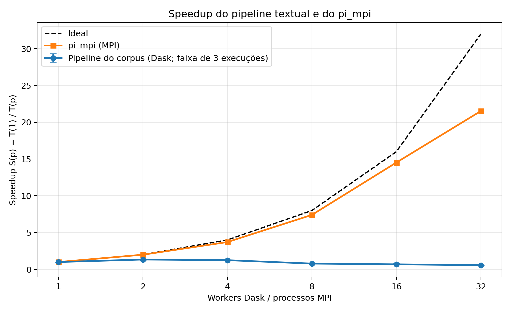

# Relatório de análise individual — Larissa Martins

## 1. Contextualização e evolução dos modelos de paralelismo

Eu vejo esta ponderada como o fechamento de um percurso construído nas aulas anteriores. Na Aula 3, nosso grupo usou MPI: cada processo era um rank, e nós escrevemos como dividir o trabalho e trocar mensagens — `MPI_Send`/`MPI_Recv` no ping-pong, `MPI_Bcast`/`MPI_Reduce` na soma e a redução para calcular π. Mantivemos o trabalho de π fixo e aumentamos o número de processos. Com esse experimento, estudamos strong scaling, speedup, eficiência e a lei de Amdahl.

Na Aula 4, estudamos Dask e Spark como outra forma de expressar computação paralela. Em vez de descrever ranks e mensagens, passamos a descrever coleções particionadas e um grafo de tarefas; o scheduler decide onde cada tarefa será executada. O notebook usou o Colab para ensinar esse modelo, não para prometer speedup de cluster: a máquina tinha apenas duas CPUs lógicas. A medição real continuava a ser feita com `sbatch`. Para a nossa ponderada, escolhemos Dask, que se encaixa nas funções Python de tokenização e limpeza do nosso pipeline. Mesmo assim, como entendo a partir da aula, a abstração não elimina o scheduler nem os custos de tarefa, serialização e movimentação de dados. Também aprendemos a relacionar isso ao cluster: o Slurm aloca os nós, o scheduler e os workers vivem dentro do job, o ambiente é lido do NFS, e o shuffle usa a rede que medimos na Aula 3.

Nas atividades práticas da Aula 4, nosso grupo executou os exemplos de π, granularidade e contagem de palavras. Eu tive participação importante ao rodá-los e interpretar seus resultados: aprendi que o scheduler e a comunicação continuam tendo custo, e que combinar contagens antes do shuffle reduz os dados transferidos. Esses aprendizados me ajudaram a analisar as escolhas do pipeline do nosso grupo.

Na ponderada, nosso grupo aplicou esse percurso a um pipeline completo de PLN. Mantivemos a escada de 1, 2, 4, 8, 16 e 32 unidades de processamento, mas trocamos o cálculo numérico intensivo de π por avaliações curtas e etapas com dependências globais. Na minha leitura, isso amplia a pergunta de “quantos processos aceleram o cálculo?” para “quais etapas paralelizam bem, quais fazem os workers trocar dados e quando coordenar custa mais que o trabalho útil?”.

## 2. Corpus, etapas do pipeline e metodologia experimental

Nosso grupo escolheu o B2W-Reviews01, um conjunto de avaliações de produtos em português brasileiro. Do CSV original, com 132.373 registros e 47,16 MiB, selecionamos 129.098 campos `review_text` não vazios. Preparamos 128 shards JSONL e uma lista fixa de 207 stopwords, totalizando 20,44 MiB. Depois da limpeza, obtivemos um vocabulário de 47.801 termos, 1.607.559 valores não nulos nas matrizes TF-IDF e 100 documentos com vetor zero. A mediana de comprimento cai de 16 tokens antes das stopwords para 10 depois delas. Para mim, isso ajuda a explicar por que cada documento oferece pouco trabalho de texto isolado.

No nosso pipeline, as quatro etapas são:

1. **Tokenização:** cada partição lê seus documentos, normaliza Unicode, aplica `casefold` e extrai sequências de letras.
2. **Remoção de stopwords:** cada worker remove a lista portuguesa fixada e mantém no corpus os documentos que ficaram vazios.
3. **Vetorização TF-IDF:** os workers contam localmente em quantos documentos cada termo aparece. O cliente combina essas frequências documentais, constrói um vocabulário e um IDF global e os distribui de volta aos workers. Cada partição calcula os vetores normalizados em L2 e grava a matriz esparsa CSR.
4. **Estatísticas:** são agregados o vocabulário, a distribuição dos comprimentos antes e depois da limpeza e os termos de maior soma TF-IDF.

Eu relaciono esse desenho ao pipeline documental de MinutAI apresentado na Aula 4: leitura, tokenização/limpeza, contagem local, estatística por termo no corpus e redução final. Na ponderada, nosso grupo aplicou esse formato ao B2W Reviews e acrescentou a vetorização TF-IDF completa. Tokenizar e contar dentro de uma partição são etapas estreitas, que podem ocorrer localmente. A frequência documental global do TF-IDF e a soma final por termo exigem juntar resultados. No nosso código, isso acontece por `gather` ao cliente, combinação de contadores e broadcast do vocabulário/IDF. Interpreto esse tráfego como um custo semelhante ao shuffle discutido na aula, embora nosso código não execute um `groupby` de DataFrame nem um all-to-all explícito. Ao combinar contagens localmente antes de transferi-las, nosso grupo evita mover cada ocorrência de palavra individualmente.

Nosso grupo usou 128 partições, relacionando a configuração à discussão de granularidade da Aula 4. Isso dá oito partições por worker em 16 workers e quatro por worker em 32, dentro da faixa prática sugerida no material: não criamos uma tarefa por documento, mas mantemos blocos suficientes para redistribuição. Por isso, interpreto a queda de speedup em escala alta como algo que não se explica simplesmente por milhares de tarefas minúsculas. O custo global de comunicação, coordenação e armazenamento continua relevante mesmo com uma quantidade moderada de partições.

Nosso grupo submeteu as seis configurações via Slurm e executou o corpus integral três vezes; o CSV registra a mediana de cada coluna. Usamos um worker em um nó como base single-node. Até quatro workers cabem em um nó; oito usam dois nós; 16 usam quatro nós, com quatro workers por nó; e 32 usam oito workers por nó, ocupando também as threads de SMT. Eu vejo nisso uma ligação entre duas escolhas didáticas: a Aula 4 recomenda quatro processos de uma thread por nó para funções Python puras, pois várias threads do mesmo processo são limitadas pelo GIL; a ponderada acrescenta o ponto de 32 processos para medir as threads de hardware adicionais. Processos Python separados não compartilham um único GIL, mas as duas threads de hardware em cada core ainda dividem recursos físicos. Nosso tempo total vai da leitura distribuída à agregação das estatísticas e inclui comunicação e gravação das matrizes. Excluímos o startup dos processos e a validação dos hashes. As repetições seguem a mesma ordem e não limpam caches.

## 3. Resultados e comparação dos speedups

No gráfico, comparo os speedups medidos do corpus e do π MPI com a referência linear ideal. Para cada carga, calculei `S(p) = T(1)/T(p)` usando seu próprio tempo com uma unidade. As barras na curva do corpus mostram a faixa min–máx das três repetições, calculada com o tempo-base mediano de um worker; são uma descrição da variação observada, não um intervalo de confiança. Não comparo diretamente os segundos absolutos dos programas, pois o trabalho e o volume de dados são diferentes.

| Workers / processos | Nós do corpus | Tempo corpus (s) | Speedup corpus | Eficiência corpus | Tempo π MPI (s) | Speedup π MPI | Ideal |
| ---: | ---: | ---: | ---: | ---: | ---: | ---: | ---: |
| 1 | 1 | 6,353340 | 1,000 | 100,0% | 34,8664 | 1,000 | 1 |
| 2 | 1 | 4,735173 | 1,342 | 67,1% | 17,4564 | 1,997 | 2 |
| 4 | 1 | 5,073977 | 1,252 | 31,3% | 9,3902 | 3,713 | 4 |
| 8 | 2 | 8,046799 | 0,790 | 9,9% | 4,7082 | 7,405 | 8 |
| 16 | 4 | 9,216111 | 0,689 | 4,3% | 2,4007 | 14,523 | 16 |
| 32 | 4 | 11,172532 | 0,569 | 1,8% | 1,6198 | 21,525 | 32 |

Calculei a eficiência do corpus como `E(p) = S(p)/p`. Ela cai rapidamente: 67,1% com dois workers, 31,3% com quatro e 1,8% com 32. Isso expressa quanto do paralelismo ideal o pipeline aproveita; não é uma medida isolada de utilização de CPU.

Também comparei as três medições individuais do tempo total, que estão disponíveis nos artefatos do lote. O coeficiente de variação (desvio padrão amostral dividido pela média) é apenas descritivo, pois há três repetições por configuração.

| Workers | Mínimo (s) | Mediana (s) | Máximo (s) | Coeficiente de variação |
| ---: | ---: | ---: | ---: | ---: |
| 1 | 6,307 | 6,353 | 6,532 | 1,85% |
| 2 | 4,710 | 4,735 | 5,046 | 3,88% |
| 4 | 4,960 | 5,074 | 5,159 | 1,98% |
| 8 | 7,918 | 8,047 | 8,164 | 1,53% |
| 16 | 7,833 | 9,216 | 9,346 | 9,53% |
| 32 | 10,968 | 11,173 | 11,882 | 4,23% |

Na minha leitura, o π MPI se aproxima da linha ideal até 16 processos: o speedup 14,523 corresponde a 90,8% de eficiência. Em 32, nosso tempo ainda cai de 2,4007 s para 1,6198 s, mas a eficiência cai para 67,3%. Vejo a curva dobrar em 32 processos, quando o cluster passa de 16 cores físicos para duas threads de hardware por core. Isso é coerente com custo de SMT e comunicação MPI entre nós, embora os dados do nosso grupo não isolem a contribuição de cada fator. Na Aula 3, nosso relatório ajustou Amdahl ao π e estimou `f ≈ 1,32%`; o modelo previu `S(32) ≈ 22,708`, próximo, mas acima, do valor medido de 21,525.

Nosso pipeline apresenta outro perfil. Dois workers são o melhor ponto que medimos: o tempo cai 25,5%, de 6,353 s para 4,735 s, mas isso equivale a speedup de apenas 1,342 e eficiência de 67,1%. Quatro workers ainda terminam 20,1% mais rápido que a base, porém o ganho é menor que com dois. Com oito workers, já em dois nós, a mediana sobe para 8,047 s; em 16 e 32, chega a 9,216 s e 11,173 s. Essas medianas têm speedup abaixo de 1: neste experimento, adicionar workers aumentou o tempo total típico. A variação pede uma ressalva: uma das três execuções com 16 workers levou 7,833 s, enquanto as outras duas levaram 9,216 s e 9,346 s. Portanto, a mediana de 16 workers é maior que a de oito, mas a piora não ocorreu em todas as repetições. Com apenas três observações, não consigo determinar a causa dessa dispersão nem estimar sua distribuição. Eu não generalizo esse resultado para Dask; ele descreve a implementação do nosso grupo, essa carga e esse cluster.

## 4. Discussão dos gargalos de desempenho

Para interpretar o contraste, considero a natureza das duas cargas. Nosso cálculo Monte Carlo de π fornece bilhões de amostras independentes: cada processo faz bastante trabalho local e participa de reduções pequenas no fim. Já o pipeline de PLN lê textos curtos, executa funções Python por partição, estabelece estatísticas globais para o TF-IDF e grava uma matriz por partição. Quando nosso grupo acrescenta workers, a parte de cálculo pode diminuir, mas leitura, scheduler, trocas de dados e etapas no cliente permanecem.

- **I/O compartilhado:** no nosso experimento, os workers leem os shards do NFS em `/opt/ohpc/pub`; as matrizes e evidências são gravadas no diretório compartilhado do lote. Mais leitores podem disputar o armazenamento e a rede. Na Aula 3, nosso grupo mediu cerca de 859 Mbit/s para uma transferência grande entre nós, perto de 86% de um link nominal de 1 Gbit/s. Uso esse número como contexto da capacidade do cluster; ele não mede a vazão do NFS nem o tráfego deste pipeline. Como não cronometramos leitura e gravação separadamente, considero I/O um gargalo plausível, mas não uma causa isolada quantificada.
- **Comunicação, shuffle e serialização:** no nosso pipeline, as frequências documentais locais convergem para formar o vocabulário/IDF global, que depois chega a todos os workers. Essa coordenação custa transferência e serialização. Para mim, isso exemplifica a lição do shuffle da Aula 4: uma resposta global exige comunicação, e o desempenho depende de quanto combinamos localmente antes de mover dados. O π MPI transfere principalmente resultados pequenos e paga bem menos por esse tipo de operação.
- **Scheduler e fração no cliente:** em nossos registros, `t_serial` cresce de 1,018 s com um worker para 9,916 s com 32, passando de 16,0% para 88,8% do tempo total. Essa parcela inclui combinação de frequências, construção e broadcast do vocabulário/IDF e agregação final no cliente. `t_calc` também inclui espera, comunicação e I/O; eu não o interpreto como medida pura de CPU. Portanto, a parcela marcada como serial não é uma constante intrínseca do algoritmo: ela varia com a quantidade de dados a reunir e com a configuração.
- **A transição para vários nós:** ao passar de quatro workers em um nó para oito em dois nós, nosso tempo aumenta de 5,074 s para 8,047 s. Essa diferença coincide com a introdução de comunicação entre nós e mais coordenação, mas a medição do grupo não separa rede, contenção de I/O e scheduler. Como o crescimento já começa entre dois e quatro workers no mesmo nó, concluo que a rede gigabit não explica sozinha a curva.
- **SMT a partir de 16 workers:** usamos 16 workers para ocupar os 16 cores físicos do cluster; com 32, passamos às segundas threads de hardware. Na minha avaliação, isso pode explicar parte do ganho fraco entre 16 e 32, mas não a regressão que já aparece em 8 e 16. O maior obstáculo observado no corpus é o custo global variável, não apenas SMT.

## 5. Estimativa da fração serial pela lei de Amdahl

O modelo clássico é `S(p) = 1 / (f + (1-f)/p)`, em que `f` é uma fração serial fixa. Usando o melhor ponto paralelo que nosso grupo mediu no corpus, `p=2` e `S(2)=1,3417`, calculo a estimativa efetiva

`f = (p/S(p) - 1)/(p - 1) = (2/1,3417 - 1) ≈ 0,491`.

Assim, **a medição com dois workers sugere aproximadamente 49% de fração serial efetiva**, e o limite ideal de speedup associado seria `1/f ≈ 2,04`. Eu uso isso como uma aproximação local para explicar o ganho inicial pequeno, não como uma propriedade fixa do código. Para conferir o limite do modelo, calculei também as frações implícitas nos demais pontos: quatro workers sugerem `f ≈ 0,732`; oito, 16 e 32 implicam, respectivamente, `f ≈ 1,305`, `1,481` e `1,783`. Frações acima de 1 são impossíveis no modelo clássico; para mim, elas indicam custos adicionais que crescem com `p`.

Essa estimativa também difere da razão `t_serial/t_total` com um worker, que é 16,0%. A razão simples mede a decomposição instrumentada nessa configuração; minha estimativa de Amdahl vem do speedup observado ao passar de um para dois workers e incorpora o overhead dessa mudança. Como nosso `t_serial` também cresce muito com o número de workers, concluo que um único `f` constante não explica toda a curva do corpus. Em oito workers, `S(8)=0,790` significa `T(8) ≈ 1,267 × T(1)`, ou cerca de 26,7% mais tempo que a base — não oito vezes mais lento. A lei de Amdahl básica não modela esse custo variável.

## 6. Conclusões e limitações

Minha conclusão é que a ponderada conecta as duas aulas: MPI nos ensinou a localizar comunicação e medir escalabilidade; Dask transformou a programação em um grafo e automatizou a distribuição; o pipeline do nosso grupo mostrou que essa abstração não elimina serialização, shuffle, I/O nem etapas centrais. A curva de π é favorável ao paralelismo porque contém muito cálculo independente. Nosso corpus é uma carga de processamento de dados com pouco trabalho por partição e dependências globais. Para trabalhos futuros, eu priorizaria escolher as partições e o framework de acordo com o trabalho, reduzir os dados transferidos e medir cada etapa antes de simplesmente aumentar o número de workers.

Nosso grupo mediu medianas de três execuções em ordem fixa, sem limpar cache nem calcular intervalos de confiança. A decomposição `t_serial`/`t_calc` não é um perfil detalhado; não cronometramos rede, NFS, serialização e processamento separadamente. O gráfico também não compara a velocidade absoluta de π com PLN: cada curva é normalizada pelo próprio caso de uma unidade. Se eu analisar um novo lote submetido pela `main` atual, usarei o CSV desse lote sem misturá-lo com `run-20260930-corpus02`.

## Referências e evidências

- `Aula 3 - MPI e SLURM`: ping-pong, `Bcast`/`Reduce`, curva de `pi_mpi`, comunicação gigabit e lei de Amdahl, resumidos em [RELATORIO_AULA03.md](../../RELATORIO_AULA03.md).
- `Aula 4 - Spark e Dask`, notebook (exercícios de π, grafo, granularidade e word count) e roteiro de laboratório (jobs Slurm e cluster): scheduler, avaliação preguiçosa, custo por tarefa, shuffle, NFS e topologia dos workers.
- [Resultados e protocolo do corpus](../../pipeline/RELATORIO.md), [CSV do corpus](../../resultados/speedup_corpus.csv), [CSV do pi_mpi](../../resultados/speedup.csv) e [fluxo atual para reproduzir o corpus](../../pipeline/README.md).
