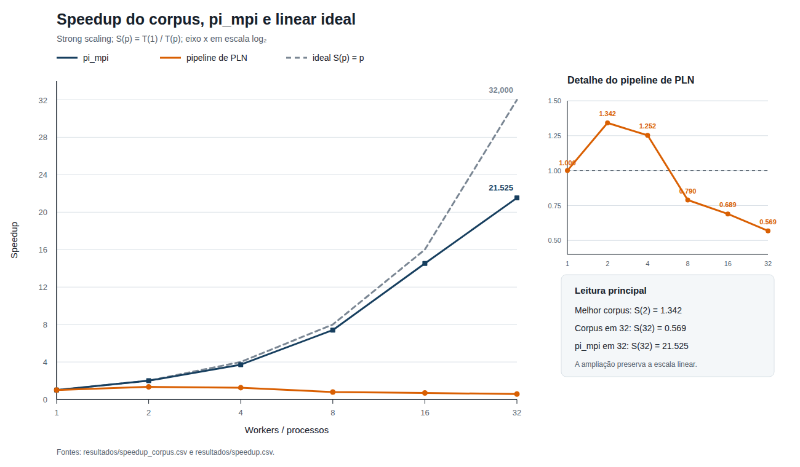

# Análise individual — Leonardo Ogata Pedrosa

## Método de comparação

Comparei os seis pontos de `resultados/speedup_corpus.csv` com os seis pontos de `resultados/speedup.csv`. Para cada experimento, calculei o speedup por

\[
S(p)=\frac{T(1)}{T(p)}
\]

e a eficiência por \(E(p)=S(p)/p\). O pipeline de corpus usa a mediana de três execuções em cada configuração. O `pi_mpi` usa, conforme o roteiro da Aula 3, o menor tempo entre as duas séries completas. Os dois experimentos são de *strong scaling*: o tamanho do problema permanece fixo enquanto cresce o número de workers ou processos.

O painel principal mantém a escala linear necessária para comparar as três curvas. A ampliação à direita mostra a curva do corpus sem alterar a escala. Os dados de origem são [speedup_corpus.csv](../../resultados/speedup_corpus.csv) e [speedup.csv](../../resultados/speedup.csv).

| Workers/processos | Tempo do corpus (s) | Speedup do corpus | Eficiência do corpus | Speedup do `pi_mpi` | Linear ideal |
| ---: | ---: | ---: | ---: | ---: | ---: |
| 1 | 6,353340 | 1,000 | 100,0% | 1,000 | 1 |
| 2 | 4,735173 | 1,342 | 67,1% | 1,997 | 2 |
| 4 | 5,073977 | 1,252 | 31,3% | 3,713 | 4 |
| 8 | 8,046799 | 0,790 | 9,9% | 7,405 | 8 |
| 16 | 9,216111 | 0,689 | 4,3% | 14,523 | 16 |
| 32 | 11,172532 | 0,569 | 1,8% | 21,525 | 32 |

## Interpretação das curvas

O melhor resultado do corpus ocorre com dois workers: o tempo cai de 6,353 s para 4,735 s e o speedup chega a 1,342. Com quatro workers, o tempo já sobe para 5,074 s. A partir de oito, o pipeline fica mais lento que a execução de referência, pois \(S(p)<1\). Em 32 workers, ele leva 11,173 s, 75,9% mais que a execução com um worker, e atinge speedup de apenas 0,569.

O `pi_mpi` tem comportamento muito diferente. Seu cálculo Monte Carlo é computacionalmente intenso, quase independente entre ranks e movimenta poucos dados. A curva acompanha de perto a ideal até 16 processos: \(S(16)=14{,}523\). Em 32 processos, ainda alcança \(S(32)=21{,}525\), embora a eficiência caia para 67,3%. O pipeline textual distribui uma carga total pequena, de 129.098 documentos curtos e 128 partições, e executa leitura, coordenação, distribuição de estruturas globais e escrita. Nesse caso, o trabalho útil por worker diminui antes que esses custos sejam amortizados.

## Gargalos que afastam as curvas

### I/O no NFS

Cada repetição lê os 128 shards JSONL do corpus no NFS e grava 128 matrizes esparsas NPZ em armazenamento compartilhado. Aumentar o número de leitores e escritores não multiplica a vazão do servidor nem da interface de rede. Como o intervalo medido inclui a leitura e a escrita, a contenção de I/O permanece no tempo total mesmo quando a computação local diminui. O cache do sistema de arquivos não foi limpo entre as repetições, portanto a mediana representa o protocolo executado, mas não isola o desempenho do NFS.

### Shuffle, comunicação e serialização

O código não faz um *shuffle* tabular geral do Dask, mas realiza movimentos de dados com efeito semelhante para a escalabilidade: coleta as frequências documentais e os comprimentos no cliente, combina os `Counter`, constrói o vocabulário e o IDF globais, serializa e distribui essas estruturas a todos os workers e, ao final, coleta os totais de TF-IDF. Quanto mais workers participam, maior é a quantidade de mensagens, objetos serializados e tarefas que o scheduler precisa coordenar. Assim, a redução do tempo local de tokenização e vetorização não se converte diretamente em redução do tempo de parede.

Essa tendência aparece na decomposição medida. `t_calc` cai de 5,335 s com um worker para 1,226 s com 32, mas `t_serial` cresce de 1,018 s para 9,916 s. A parcela marcada como serial passa de 16,0% para 88,8% do tempo total. Neste experimento, `t_serial` inclui coordenação no cliente e distribuição do vocabulário/IDF; portanto, não representa somente código inerentemente sequencial.

### Rede gigabit

Ao passar de quatro para oito workers, a execução sai de um nó e passa a usar dois. Com 16 workers, usa os quatro nós. Metadados, vocabulário, IDF, resultados parciais e tráfego de NFS atravessam a rede gigabit compartilhada. O ping-pong da Aula 3 mediu 107,4 MB/s para mensagens de 1 MiB entre nós, aproximadamente 85,9% do limite nominal de 1 Gbit/s, além de latência muito maior que a comunicação dentro do nó. Esse resultado não mede diretamente o tráfego do Dask, mas mostra que a rede tem um teto baixo para várias transferências concorrentes. O salto do tempo total de 5,074 s em quatro workers para 8,047 s em oito é compatível com a entrada desses custos entre nós.

### Hyperthreading a partir do limite de 16 workers

O cluster possui 16 cores físicos e 32 CPUs lógicas. Com 16 workers, todos os cores físicos já estão ocupados; ao avançar para 32, passam a ser usadas duas threads de hardware por core, isto é, hyperthreading/SMT. As threads irmãs compartilham unidades de execução, caches e largura de banda de memória. Por isso, duplicar os workers não duplica a capacidade de cálculo. Entre 16 e 32, `t_calc` melhora somente 13,6%, de 1,419 s para 1,226 s, enquanto `t_serial` aumenta 27,2%, de 7,797 s para 9,916 s. O tempo total piora 21,2%.

### Fração serial e granularidade

O corpus inteiro leva apenas 6,353 s na referência. Ao dividi-lo entre muitos workers, cada worker recebe pouco trabalho útil, mas ainda participa do agendamento, da serialização, das barreiras lógicas, das transferências e do I/O. Há também etapas centralizadas: combinação das frequências documentais, criação do vocabulário e do IDF e agregação das estatísticas finais. Essa fração não permanece constante: ela cresce com \(p\), o que explica por que a curva fica até abaixo de \(S=1\).

## Estimativa da fração serial pela lei de Amdahl

A lei de Amdahl modela o speedup como

\[
S(p)=\frac{1}{f+\frac{1-f}{p}},
\]

onde \(f\) é uma fração serial constante e se assume que o overhead não cresce com \(p\). Linearizando,

\[
\frac{1}{S(p)}=f+(1-f)\frac{1}{p}.
\]

O ajuste linear dos seis pontos tem intercepto \(f=1{,}3739\), ou 137,4%, que não pode ser uma fração física. Não é adequado truncar esse resultado para 100% e apresentá-lo como estimativa: para \(0\leq f\leq1\), o modelo clássico prevê \(S(p)\geq1\), mas o pipeline medido fica abaixo de 1 a partir de oito workers. Isso indica que uma fração serial constante não explica os dados; overhead variável precisa ser considerado.

Uma estimativa local ainda útil vem da passagem de um para dois workers:

\[
f_{1\rightarrow2}=\frac{1/S(2)-1/2}{1-1/2}=0{,}4906.
\]

Assim, **a fração serial efetiva estimada nessa passagem é 49,1%**, correspondente a um limite ideal \(S_{max}=1/f\approx2{,}04\). Ela não deve ser confundida com a fração literal de instruções seriais nem extrapolada para todas as configurações. A tabela compara essa previsão com os dados e mostra a fração que cada ponto exigiria se fosse explicado isoladamente pelo modelo:

| Workers \(p\) | Speedup medido | Speedup previsto com \(f=0{,}4906\) | \(f\) aparente do ponto |
| ---: | ---: | ---: | ---: |
| 2 | 1,342 | 1,342 | 49,1% |
| 4 | 1,252 | 1,618 | 73,2% |
| 8 | 0,790 | 1,804 | 130,5% |
| 16 | 0,689 | 1,914 | 148,1% |
| 32 | 0,569 | 1,974 | 178,3% |

Os valores acima de 100% não são frações seriais físicas. São um diagnóstico de que o custo efetivo cresce com o paralelismo; portanto, os 49,1% são a estimativa de Amdahl mais interpretável para a região de baixa concorrência, enquanto os demais pontos evidenciam o limite do modelo simples.

## Conclusão

O experimento mostra que adicionar workers não é suficiente para acelerar um pipeline distribuído. O `pi_mpi` escala porque oferece muito cálculo independente por processo e pouca comunicação. No corpus, dois workers ainda compensam o overhead, mas, a partir de quatro, o custo de coordenar e movimentar os dados cresce mais rápido que a redução do cálculo local. NFS, serialização e transferências coletivas, rede gigabit, etapas centralizadas e SMT em 32 workers explicam a distância para a curva ideal. Para melhorar o resultado, seria necessário aumentar a granularidade do trabalho, reduzir materializações no cliente, evitar redistribuições globais, agrupar escritas e separar em medições próprias CPU, rede e I/O.
