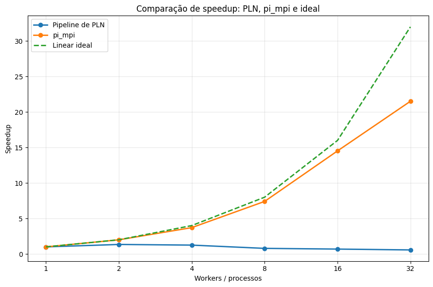
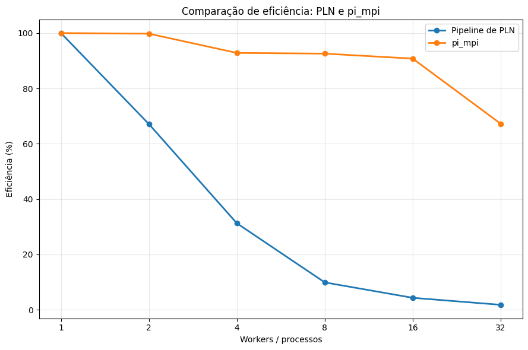

# Análise individual — Pipeline de PLN distribuído

## 1. Comparação de speedup

O experimento avaliou o pipeline de PLN com 1, 2, 4, 8, 16 e 32 workers, mantendo o mesmo corpus de 129.098 documentos. Portanto, trata-se de um caso de **strong scaling**.

O melhor resultado do pipeline ocorreu com **2 workers**, quando o speedup chegou a aproximadamente **1,34**. Com 4 workers ainda houve ganho em relação à execução com 1 worker, mas a partir de 8 workers o speedup ficou abaixo de 1.

| Workers | Speedup aproximado |
|---:|---:|
| 1 | 1,00 |
| 2 | 1,34 |
| 4 | 1,25 |
| 8 | 0,79 |
| 16 | 0,69 |
| 32 | 0,57 |

Já o `pi_mpi` apresentou um comportamento muito mais próximo do ideal, com speedups aproximados de **1,00, 2,00, 3,71, 7,41, 14,52 e 21,52**.

Isso acontece porque o `pi_mpi` é predominantemente computacional, enquanto o pipeline de PLN também depende de I/O, comunicação, sincronização e operações globais.

## 2. Eficiência

A eficiência do pipeline cai rapidamente com o aumento do número de workers:

| Workers | Eficiência aproximada |
|---:|---:|
| 1 | 100% |
| 2 | 67% |
| 4 | 31% |
| 8 | 10% |
| 16 | 4% |
| 32 | 2% |

Esse comportamento mostra que os novos recursos adicionados passam a ser pouco aproveitados a partir das configurações maiores.

## 3. Principais gargalos

Um dos principais gargalos é o **I/O no NFS**. Os workers precisam ler os shards do corpus e escrever as matrizes TF-IDF, e todos acessam o mesmo sistema de arquivos compartilhado. Com mais workers, aumenta a concorrência por esse recurso.

Também existem custos de **comunicação, serialização e redistribuição de dados**. As frequências calculadas localmente precisam ser agregadas, e o vocabulário e o IDF global precisam ser enviados novamente aos workers.

A partir de **8 workers**, a execução passa a utilizar mais de um nó. Nesse ponto, parte da comunicação passa pela **rede gigabit**, aumentando a latência e o custo das transferências.

Na configuração de **32 workers**, também é utilizado **SMT/Hyper-Threading**. Isso significa que os workers adicionais não recebem cores físicos independentes, o que ajuda a explicar a baixa eficiência nas configurações maiores.

## 4. Fração serial e Lei de Amdahl

O pipeline possui etapas que não podem ser totalmente paralelizadas, como agregação das frequências documentais, construção do vocabulário, cálculo do IDF e coordenação entre as fases.

Usando o speedup de aproximadamente **1,34 com 2 workers**, a Lei de Amdahl fornece uma estimativa de **fração serial efetiva próxima de 49%**.

Esse valor não significa que 49% do código seja literalmente sequencial. Ele representa uma parcela efetiva que inclui também custos de coordenação, comunicação, espera e I/O.

Essa estimativa ajuda a explicar por que o pipeline não continua ganhando desempenho à medida que novos workers são adicionados.

## 5. Conclusão

O `pi_mpi` se aproxima muito mais do speedup ideal porque sua carga é principalmente computacional e exige pouca comunicação durante o cálculo.

Já o pipeline de PLN possui diversos overheads, como NFS, rede, serialização, sincronização e operações globais.

Para este experimento, **2 workers apresentaram o melhor equilíbrio entre paralelismo e overhead**. A partir desse ponto, adicionar recursos aumentou mais os custos da execução distribuída do que reduziu o tempo de processamento.

O principal aprendizado é que **mais workers não significam necessariamente mais desempenho**. O ganho só acontece quando o trabalho paralelo é grande o suficiente para compensar os custos introduzidos pela distribuição.