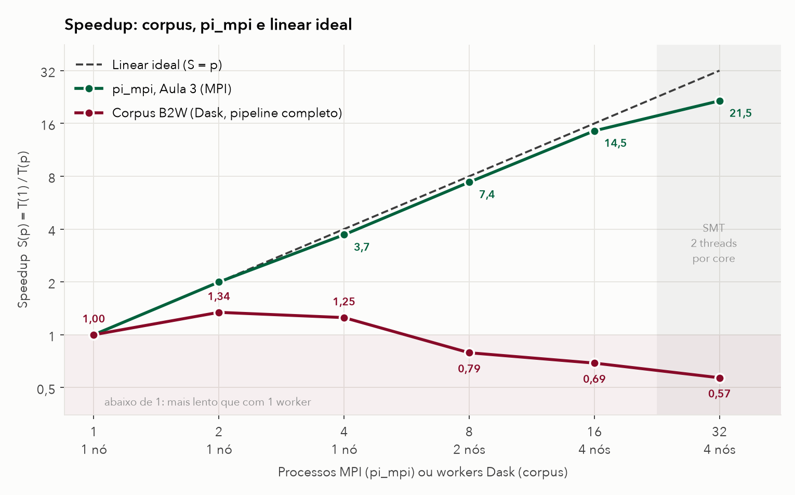
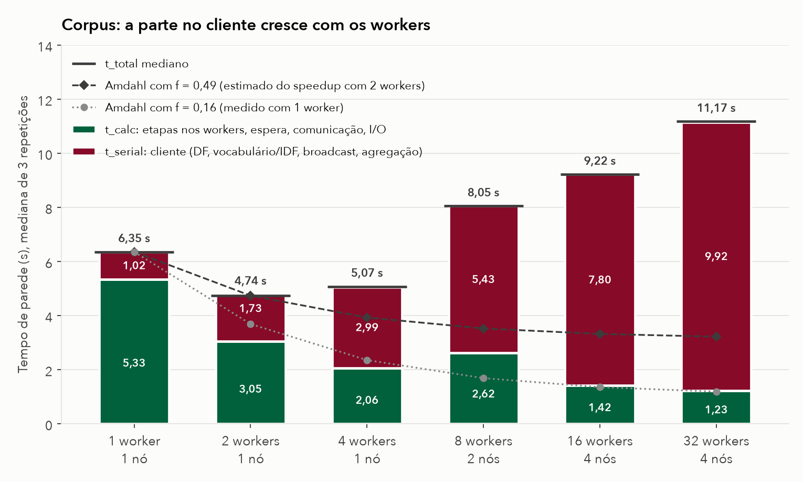
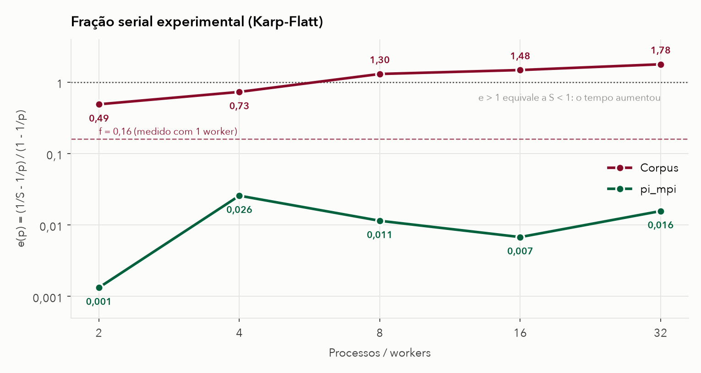

# Análise individual: Júlia Alves de Jesus

O pipeline de PLN acelerou até 2 workers (S = 1,34). Com 8 ou mais workers, ficou mais lento do que com um worker só (S = 0,57 com 32). No mesmo cluster e com a mesma distribuição por nó, o `pi_mpi` chegou a 21,5. Nesta análise eu sigo o tempo do pipeline até encontrar onde ele se perde. A causa principal é o custo de distribuir o vocabulário para os workers: ele cresce com o número de workers e, por isso, não se comporta como a fração serial fixa da lei de Amdahl.

## 1. Gráfico com as três curvas



| p | Nós | S pi_mpi | E pi_mpi | S corpus | E corpus |
| ---: | ---: | ---: | ---: | ---: | ---: |
| 1 | 1 | 1,000 | 100,0% | 1,000 | 100,0% |
| 2 | 1 | 1,997 | 99,9% | 1,342 | 67,1% |
| 4 | 1 | 3,713 | 92,8% | 1,252 | 31,3% |
| 8 | 2 | 7,405 | 92,6% | 0,790 | 9,9% |
| 16 | 4 | 14,523 | 90,8% | 0,689 | 4,3% |
| 32 | 4 | 21,525 | 67,3% | 0,569 | 1,8% |

$$
S(p) = \frac{T(1)}{T(p)} \qquad E(p) = \frac{S(p)}{p}
$$

Todas as razões deste texto são calculadas com os valores do CSV sem arredondar, então podem diferir na última casa de uma conta feita com os números arredondados. O `pi_mpi` vem de [speedup.csv](../../resultados/speedup.csv), com o menor tempo de duas séries. O corpus vem de [speedup_corpus.csv](../../resultados/speedup_corpus.csv), com a mediana de 3 repetições.

A diferença entre as duas curvas começa no tipo de problema:
- No `pi_mpi`, cada processo sorteia seus pontos sozinho. A comunicação se resume a uma barreira e um `MPI_Bcast` no início e duas reduções de um número cada no fim ([pi_mpi.c](../../aula03/pi_mpi.c), linhas 34, 40, 60 e 61). Por isso a eficiência fica acima de 90% até 16 processos e só cai para 67% em 32, quando dois processos dividem o mesmo core.
- O corpus precisa de uma etapa global no meio: o IDF de um termo depende de quantos documentos do corpus inteiro o contêm. Os workers param, o cliente junta as contagens, monta o vocabulário e devolve para todos. É nessa coordenação que a curva do corpus se afasta das outras duas.

## 2. Gargalos que explicam a distância

A primeira pergunta foi se o pipeline simplesmente não paraleliza, ou se paraleliza e perde tempo em outro lugar. Para responder, usei a separação que o grupo já mede em cada execução:
- `t_calc`: etapas nos workers, espera, comunicação e I/O.
- `t_serial`: trabalho no cliente, que inclui somar os DFs, montar vocabulário e IDF, fazer o broadcast dos dois e agregar os resultados.



| p | t_total (s) | t_serial (s) | t_calc (s) |
| ---: | ---: | ---: | ---: |
| 1 | 6,353 | 1,018 | 5,335 |
| 2 | 4,735 | 1,734 | 3,047 |
| 4 | 5,074 | 2,987 | 2,064 |
| 8 | 8,047 | 5,428 | 2,619 |
| 16 | 9,216 | 7,797 | 1,419 |
| 32 | 11,173 | 9,916 | 1,226 |

A resposta é a segunda opção:
- A parte distribuída acelera. `t_calc` cai de 5,33 s para 1,23 s, 4,35 vezes mais rápido com 32 workers.
- O trabalho no cliente vai na direção contrária. `t_serial` sobe de 1,02 s para 9,92 s e, com 32 workers, ocupa 89% do tempo.

As barras e a tabela são as medianas de cada coluna do CSV. Por isso, a soma das duas parcelas pode diferir do total mediano (o traço horizontal sobre cada barra) em até 0,05 s. As duas linhas de Amdahl da figura são discutidas na seção 3.

### Fração serial

Se o problema está no `t_serial`, a próxima pergunta é qual etapa dele cresce. Três das quatro etapas trabalham sempre com as mesmas 128 partições, então não mudam com o número de workers. A única que muda é o broadcast do vocabulário e do IDF ([pipeline.py:114-115](../../pipeline/pipeline.py)), porque ele manda uma cópia para cada worker.

O `t_serial` aumentou, por worker adicionado:

| Passagem | 1 → 2 | 2 → 4 | 4 → 8 | 8 → 16 | 16 → 32 |
| --- | ---: | ---: | ---: | ---: | ---: |
| Aumento por worker | 0,72 s | 0,63 s | 0,61 s | 0,30 s | 0,13 s |

Logo, a parte serial deste pipeline não é fixa, ao contrário do que a lei de Amdahl supõe. O aumento por worker diminui quando os workers se espalham por 4 nós. Isso combina com a forma como o Dask replica os dados, descrita abaixo, mas eu não medi esse efeito isoladamente.

### Shuffle e serialização

O pipeline não faz shuffle all-to-all. Ele faz:
1. um gather dos metadados de cada partição (DFs e comprimentos) para o cliente;
2. um broadcast do vocabulário e do IDF;
3. um gather final dos totais de TF-IDF de cada partição.

É o mesmo desenho de um `MPI_Reduce` seguido de `MPI_Bcast`. Faltava saber por que esse broadcast custa tanto, se o vocabulário tem só 47.801 termos.

A explicação está na forma como o vocabulário é enviado: como um `dict` Python. O Dask 2026.8.0 serializa um `dict` comum item por item (`iterate_collection`, em `distributed/protocol/serialize.py`) e replica o dado em árvore entre os workers (`Scheduler.replicate`). Cada worker que repassa o vocabulário o serializa de novo.

Medi isso com o vocabulário real do lote, fora do cluster ([bench_broadcast.py](bench_broadcast.py)):

| Medida | dict (como no pipeline) | mesmo conteúdo em bytes |
| --- | ---: | ---: |
| Uma cópia, serializar e desserializar | 47.803 frames, 3,12 MB, 530 ms (465 + 66) | pickle de 0,73 MB, 9 ms |
| Broadcast para 1 / 2 / 4 / 8 workers | 0,85 / 1,45 / 2,73 / 5,98 s | 1,4 / 3,0 / 4,8 / 7,9 ms |

O teste roda numa máquina só, sem rede, e mesmo assim o tempo cresce com o número de workers. O custo, então, é CPU gasta serializando e desserializando, não transferência. Os números estão em [serializacao_local.csv](serializacao_local.csv) e [broadcast_local.csv](broadcast_local.csv), medidos na minha máquina, fora do cluster. Na coluna de bytes, o vocabulário já vai serializado; o pickle feito uma vez no cliente e desfeito em cada worker não entra nesses tempos.

### Rede gigabit

Para ter certeza de que a rede não era a causa principal, estimei o custo das transferências com o modelo de custo de mensagem

$$
T(n) = \alpha + \frac{n}{\beta}
$$

usando os valores do ping-pong da Aula 3 ([bloco2-pingpong.csv](../../resultados/bloco2-pingpong.csv)): β = 107,4 MB/s entre nós e α ≈ 99,5 µs de latência por mensagem (metade do round trip de 1 byte). A estimativa supõe que tudo passa por um único enlace, o pior caso:

| Transferência | Volume | Tempo |
| --- | ---: | ---: |
| Dataset preparado ([manifest](../../pipeline/dataset-manifest.json)) | 21,4 MB | 0,20 s |
| Broadcast do vocabulário para 32 workers (32 cópias de 3,12 MB) | 99,9 MB | 0,93 s |
| Broadcast do IDF para 32 workers (32 cópias de 47.801 float64) | 12,2 MB | 0,11 s |
| Matrizes CSR sem compressão: 1.607.559 valores × 12 bytes ([statistics.json](../../resultados/pipeline/run-20260930-corpus02/w01-r1/statistics.json)), mais `indptr` e IDs em int64 ([pipeline.py:56-61](../../pipeline/pipeline.py)) | 21,4 MB | 0,20 s |

A soma dá cerca de 1,44 s. Somando a latência de 128 leituras e 128 escritas, fica perto de 1,5 s, contra 11,17 s de tempo total com 32 workers. A rede aparece de fato em um ponto: de 4 para 8 workers, quando o pipeline passa de 1 para 2 nós, `t_calc` sobe de 2,06 s para 2,62 s. É a única vez em que ele aumenta, e é quando gathers e tarefas começam a cruzar o switch.

### I/O no NFS

O corpus preparado (21,4 MB) é lido do NFS em `/opt/ohpc/pub`, e as matrizes são gravadas em `/home`, também por NFS. As repetições não limpam o cache, então a primeira de cada configuração é a que mais depende do NFS.

Comparei a primeira repetição com a mediana ([measurement.json](../../resultados/pipeline/run-20260930-corpus02/)). Em cinco das seis configurações, ela teve `t_calc` de 0,06 s a 0,23 s acima da mediana; com 32 workers, foi a própria mediana. Esse valor é da mesma ordem dos 0,20 s estimados para ler o corpus pela rede. Neste tamanho de dataset, o NFS pesa décimos de segundo. Ele passaria a importar com um corpus bem maior.

### Hyperthreading a partir de 16 workers

O cluster tem 4 nós com 4 cores físicos e 2 threads por core. Com 16 workers, são 4 por nó, o mesmo número de cores físicos. Os workers não são fixados em cores (`--cpu-bind=none` em [job_corpus.sbatch](../../pipeline/job_corpus.sbatch), linha 36), então o sistema operacional pode colocar dois deles no mesmo core, mas há um core livre para cada. Com 32 workers, 8 por nó, dois workers dividem obrigatoriamente cada core. Há uma ressalva: o scheduler e o cliente do Dask rodam no primeiro nó ([job_corpus.sbatch](../../pipeline/job_corpus.sbatch), linhas 28 e 43), então nesse nó já há disputa de CPU antes dos 32.

| De 16 para 32 | Ganho |
| --- | ---: |
| `pi_mpi`, tempo total (2,40 s para 1,62 s) | 1,48 vez |
| Corpus, `t_calc` (1,42 s para 1,23 s) | 1,16 vez |
| Corpus, tempo total (9,22 s para 11,17 s) | piora |

Duas threads no mesmo core dividem unidades de execução e cache, então o ganho fica bem abaixo de 2 vezes nos dois casos. No corpus, o pouco que o SMT ganha em `t_calc` é consumido pelos 16 destinos a mais no broadcast.

## 3. Fração serial pela lei de Amdahl

A lei de Amdahl, com f constante, é

$$
S(p) = \frac{1}{f + \dfrac{1 - f}{p}}
$$

Para estimar f pela lei, usei o speedup medido, como na Aula 3, onde o ajuste da curva do `pi_mpi` deu f = 0,013. No corpus, o mesmo ajuste nos 6 pontos dá intercepto 1,37 e coeficiente de 1/p negativo, o que não tem sentido físico: com 0 ≤ f ≤ 1, Amdahl nunca prevê S < 1, e o corpus fica abaixo de 1 a partir de 8 workers.

Por isso, estimei f no único trecho em que o speedup ainda cresce, de 1 para 2 workers. Isolando f na fórmula de Amdahl e usando o speedup medido com 2 workers:

$$
f = \frac{p/S(p) - 1}{p - 1} \;\Rightarrow\; f = \frac{2}{1{,}342} - 1 \approx 0{,}49
$$

Minha estimativa da fração serial do pipeline pela lei de Amdahl é **f ≈ 0,49**. O limite de speedup correspondente é

$$
S_{\max} = \frac{1}{f} \approx 2{,}04
$$

Esse valor é três vezes maior que a fração serial que o próprio pipeline mede com 1 worker:

$$
f_{\text{medido}} = \frac{t_{\text{serial}}(1)}{t_{\text{total}}(1)} = \frac{1{,}018}{6{,}353} \approx 0{,}16
$$

Se a parte serial fosse de fato 0,16 e fixa, Amdahl preveria

$$
S(2) = \frac{1}{0{,}16 + \dfrac{0{,}84}{2}} \approx 1{,}72
$$

mas o medido foi 1,34. A figura 2 mostra as duas previsões convertidas em tempo, T(p) = T(1) · (f + (1 − f)/p). Com f = 0,49 (linha tracejada), a previsão coincide com o medido em 2 workers (4,74 s) e cai até 3,22 s com 32 workers, contra 11,17 s medidos. Com f = 0,16 (linha pontilhada), a previsão já erra em 2 workers: 3,69 s contra 4,74 s. A diferença aparece porque, ao passar de 1 para 2 workers, o `t_serial` já cresce 0,72 s por causa do broadcast. Amdahl não tem um termo para custo que cresce com p, e então esse custo aparece embutido no f estimado.

Para ver se essa estimativa vale para os outros pontos, repeti a mesma inversão para cada p. É a métrica de Karp-Flatt:

$$
e(p) = \frac{\dfrac{1}{S(p)} - \dfrac{1}{p}}{1 - \dfrac{1}{p}}
$$

A leitura é esta:
- se e(p) fica estável, o limite é uma parte serial fixa, e Amdahl se aplica;
- se cresce, o limite é um overhead que aumenta com p.



| p | 2 | 4 | 8 | 16 | 32 |
| --- | ---: | ---: | ---: | ---: | ---: |
| e(p) do corpus | 0,49 | 0,73 | 1,30 | 1,48 | 1,78 |
| e(p) do `pi_mpi` | 0,001 | 0,026 | 0,011 | 0,007 | 0,016 |

No `pi_mpi`, e(p) fica perto de zero em todos os pontos, que é o caso que Amdahl descreve. No corpus, e(p) sobe a cada configuração e passa de 1 a partir de 8 workers. Um e(p) acima de 1 equivale a S < 1, o que nenhuma fração serial fixa produz. Então o f ≈ 0,49 vale como estimativa para poucos workers, mas não prevê o resto da curva: com f = 0,49, Amdahl daria S(32) = 1,97, e o medido foi 0,57. Para muitos workers, o limite real é o overhead do broadcast.

## Conclusão

O pipeline é correto: vocabulário, estatísticas e matrizes são idênticos nas 18 repetições, segundo o [validation.json](../../resultados/pipeline/run-20260930-corpus02/validation.json). Mesmo assim, neste cluster ele só compensa até 2 workers.

Dos gargalos pedidos, o que explica a distância entre as curvas é a serialização do vocabulário no broadcast. Ela aparece nas medições como uma fração serial que cresce com o número de workers: `t_serial` aumenta 8,90 s de 1 para 32 workers. Os outros são menores. O NFS e o hyperthreading pesam décimos de segundo. A rede soma no pior caso cerca de 1,5 s, e o salto medido ao passar para 2 nós foi de 0,56 s em `t_calc`.

A correção que eu testaria primeiro é enviar o vocabulário como um bloco único, em bytes ou em arrays NumPy. Na medição local, o broadcast para 8 workers caiu de 5,98 s para 7,9 ms, mais o pickle feito uma vez (9 ms de ida e volta).

## Reprodução

Na raiz do repositório, com `pipeline/requirements.txt` instalado:

```bash
python analise/julia-alves-de-jesus/bench_broadcast.py
python analise/julia-alves-de-jesus/analise.py
```

O primeiro script mede o broadcast em um `LocalCluster` e grava os dois CSVs locais. O segundo lê os CSVs do grupo e as 18 medições e gera as três figuras.
