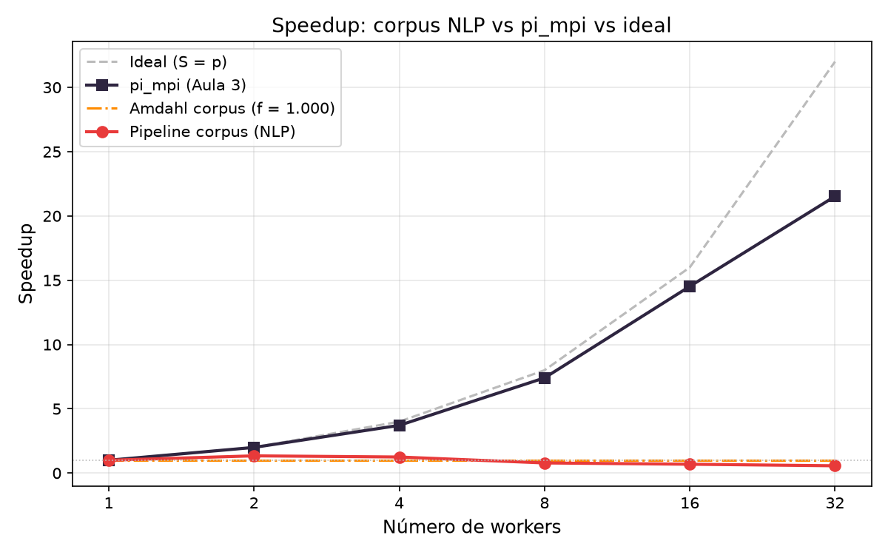
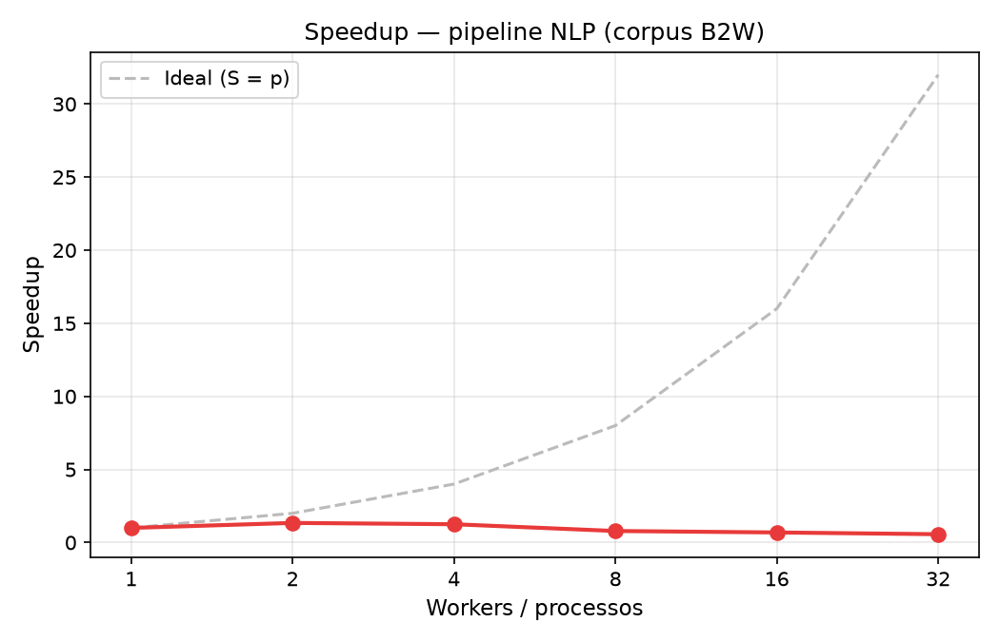
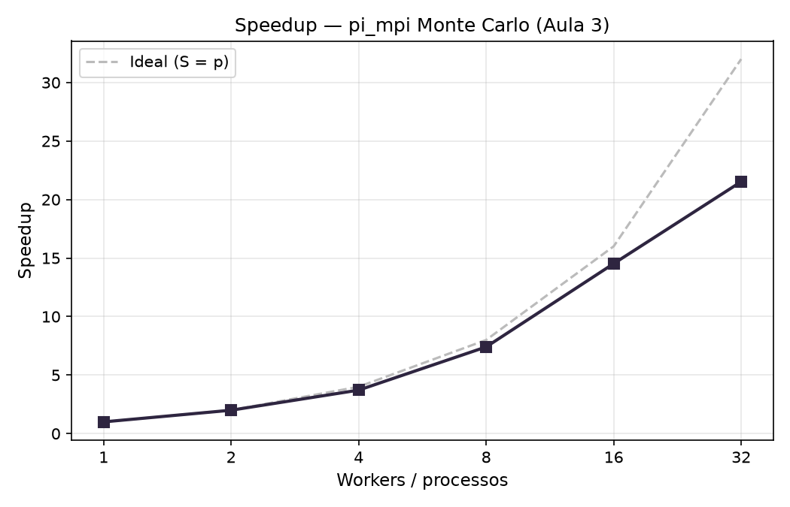
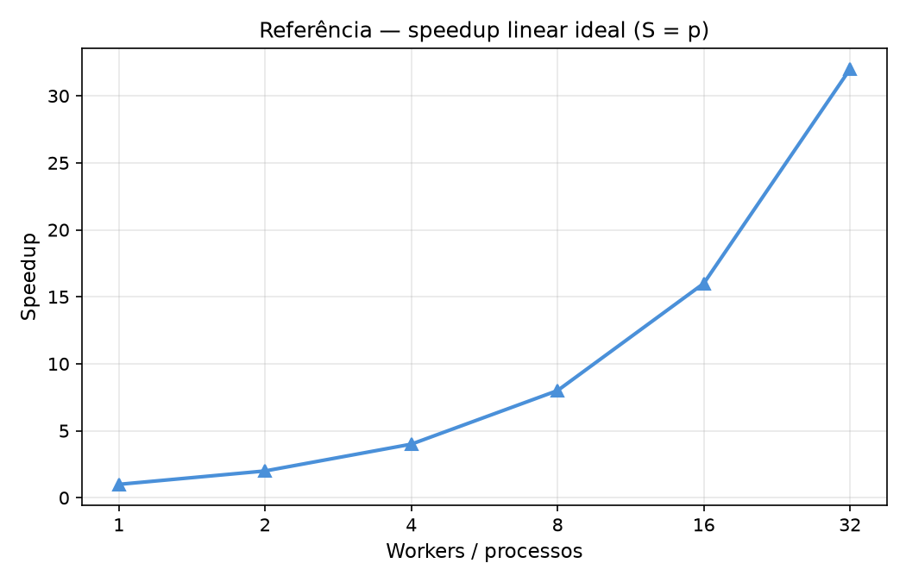

# Análise individual do pipeline distribuído

## Análise dos procedimentos

### Aula 3 - MPI e Dask

O experimento (pi_mpi) estima π por Monte Carlo com MPI: cada rank sorteia sua fatia de 4 bilhões de pontos de forma independente e a única comunicação é um `MPI_Reduce` ao final.

### Aula 4 - Pipeline NLP distribuído

O pipeline utiliza o corpus [B2W-Reviews01](https://github.com/americanas-tech/b2w-reviews01), com 129.098 avaliações em português, preparadas em 128 shards JSONL (20,44 MiB). As quatro etapas são: tokenização Unicode com casefold, remoção de 207 stopwords portuguesas, vetorização TF-IDF com IDF global e normalização L2, e agregação de estatísticas de vocabulário e termos de maior peso. Matrizes de saída em CSR/NPZ, executadas com Dask em cluster OpenHPC/Slurm nos nós `c1`-`c4`.

### Semelhanças dos dois procedimentos

Ambos distribuem trabalho entre workers, coletam resultados parciais e combinam no coordenador. O tempo é decomposto em `t_serial` (fase não paralelizável) e `t_calc` (fase distribuída). Ambos usam o mesmo cluster e as mesmas configurações: 1, 2, 4, 8, 16 e 32 workers, com três repetições cada.

### Diferenças entre os procedimentos

O pi_mpi não troca dados durante o cálculo: cada rank usa uma semente própria e só comunica um inteiro ao final. O pipeline NLP calcula vocabulário e IDF centralmente após o pré-processamento e distribui essas estruturas (47.801 termos) para todos os workers antes de vetorizar, criando uma fase serial que cresce com o número de workers.

## Gráficos

### Comparativo das 3 curvas

### Speedup do corpus

### Speedup do MPI

### Linear ideal

## Gargalos identificados

**Fração serial crescente.** `t_serial` vai de 1.02 s com 1 worker (16% do total) para 9.92 s com 32 (89%). Gather de metadados, construção do vocabulário, cálculo do IDF e agregação final rodam no coordenador e crescem com o número de workers.

| Workers | t_serial (s) | f observado |
| ---: | ---: | ---: |
| 1 | 1.018 | 0.160 |
| 2 | 1.734 | 0.366 |
| 4 | 2.987 | 0.589 |
| 8 | 5.428 | 0.675 |
| 16 | 7.797 | 0.846 |
| 32 | 9.916 | 0.888 |

**I/O no NFS.** Cada worker lê seu shard de `/opt/ohpc/pub` via NFS. Com vários nós acessando o mesmo servidor, a largura de banda vira gargalo antes do cálculo de tokens.

**Broadcast do vocabulário e IDF.** Vocabulário com 47.801 termos e vetor IDF (~373 KB em float64) são serializados e enviados para cada worker via scheduler. Com 32 workers em 4 nós, o broadcast atravessa a rede gigabit múltiplas vezes.

**Rede gigabit e latência entre nós.** A partir de 8 workers (2 nós), toda coordenação cruza a rede. A latência para mensagens pequenas e frequentes é alta, ao contrário do MPI que usa primitivas de comunicação coletiva otimizadas.

**Textos curtos e granularidade fina.** A mediana do corpus após stopwords é 10 tokens por documento. O overhead de agendar e receber cada tarefa Dask supera o ganho de paralelismo a partir de 4 workers.

**Hyperthreading a partir de 16 workers.** Com 16 workers em 4 nós, o cluster aloca em cores lógicos (SMT). Dois workers passam a competir pelo mesmo core físico e cache. Com 32 workers (8 por nó), a contenção por recursos de hardware aumenta.

**Overhead do scheduler Dask.** O scheduler é single-threaded: com 32 workers em paralelo, vira um funil de coordenação. No MPI cada rank avança de forma autônoma, sem coordenador central.

**Serialização Python no broadcast.** O Dask usa pickle para serializar o vocabulário (`dict` com 47.801 entradas) e o IDF (array NumPy). Com 32 workers, o coordenador serializa e transmite o mesmo objeto 32 vezes, parte do crescimento de `t_serial`.

**Escrita concorrente das matrizes NPZ no NFS.** As 128 matrizes de saída são escritas em paralelo em `/home/g02/corpus`, também NFS. Leitura dos shards e escrita das matrizes competem pela mesma largura de banda do servidor.

## Estimativa da fração serial do pipeline pela lei de Amdahl

A lei de Amdahl prevê:

$$S(p) = \frac{1}{f + \dfrac{1 - f}{p}}$$

onde $f$ é a fração serial fixa do programa. Usando a fração medida com 1 worker:

$$f = \frac{t_{serial}(p=1)}{t_{total}(p=1)} = \frac{1{,}018}{6{,}353} \approx 0{,}160$$

Speedup máximo teórico ($p \to \infty$):

$$S_{max} = \frac{1}{f} = \frac{1}{0{,}160} \approx 6{,}24\times$$

Na prática, o pico foi 1.342x com 2 workers. A razão é que `f` não é constante: cresce de 16% com 1 worker para 89% com 32, à medida que o overhead de coordenação escala com o número de workers. O modelo descreve bem o pi_mpi, onde `f` é fixo e pequeno, mas subestima o pipeline NLP, onde o gargalo é manter um vocabulário global consistente entre todos os workers.

## Conclusão

Os dois experimentos usam o mesmo cluster, mas produzem curvas opostas. O pi_mpi chega a 21.5x com 32 processos porque o problema é embaraçosamente paralelo: cada rank é independente e a comunicação se resume a um `MPI_Reduce`. O pipeline NLP atinge 1.342x com 2 workers e regride até 0.569x com 32, mais lento do que com um único worker.

A diferença está na fração serial. No pi_mpi ela é fixa e menor que 0,02% do tempo. No pipeline NLP cresce de 16% para 89% porque construir e distribuir o vocabulário global fica mais caro a cada worker adicionado. O modelo de Amdahl prevê $S_{max} = 6{,}24\times$ com $f = 0{,}160$, mas esse valor só vale se `f` for constante. Para esse pipeline, 2 workers no mesmo nó foi a configuração mais eficiente: elimina a leitura serial dos shards sem pagar coordenação entre nós.
