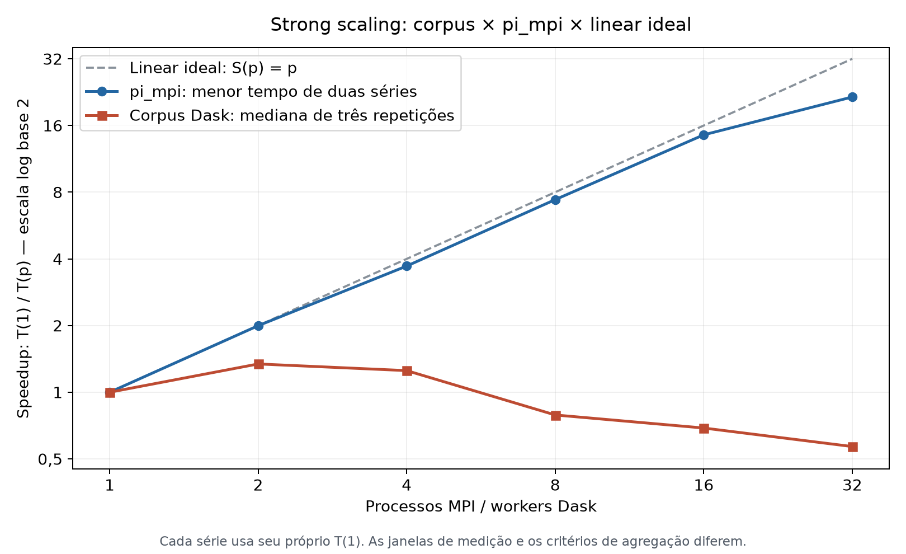

# Análise individual — Marco Ruas Sales Peixoto

## Qual configuração vale a pena para esta carga?

Minha pergunta é: **qual configuração termina mais rápido sem reservar mais recursos?** Uso a mediana de três repetições do [corpus](../../resultados/speedup_corpus.csv) e o menor tempo de duas séries do [pi_mpi](../../resultados/speedup.csv).

O gráfico compara `S(p) = T(1)/T(p)` de cada carga com o ideal `S(p) = p`. Cada série usa seu próprio tempo-base.



O MPI chega a **21,525× com 32 processos**; o corpus alcança **1,342× com dois workers** e regride a partir de oito. O MPI faz cálculo independente sem I/O; o corpus processa 129.098 textos curtos com leitura, comunicação e escrita. Comparo escalabilidade relativa, não superioridade entre frameworks.

## Tempo e recursos reservados

Como os jobs usam nós exclusivos, acrescento um índice de demanda do trecho cronometrado:

```text
D(p) = número de nós × tempo mediano
```

A unidade **nó-segundos** representa reserva de nós no trecho medido, não utilização real de CPU, energia ou preço. Startup e intervalos fora da medição ficam excluídos.

| Workers | Nós | Tempo mediano (s) | Speedup | Nó-segundos | Demanda / base |
| ---: | ---: | ---: | ---: | ---: | ---: |
| 1 | 1 | 6,353 | 1,000 | 6,353 | 1,00× |
| 2 | 1 | 4,735 | 1,342 | 4,735 | 0,75× |
| 4 | 1 | 5,074 | 1,252 | 5,074 | 0,80× |
| 8 | 2 | 8,047 | 0,790 | 16,094 | 2,53× |
| 16 | 4 | 9,216 | 0,689 | 36,864 | 5,80× |
| 32 | 4 | 11,173 | 0,569 | 44,690 | 7,03× |

**Dois workers venceram nos dois critérios:** menor tempo e menor demanda. Um, dois e quatro workers reservam um nó; dois reduziram ambos os indicadores em **25,47%** frente à base. Com 32 workers, foram reservados quatro nós e exigidos **7,03 vezes mais nó-segundos**, com maior tempo.

Eu escolheria dois workers para esta versão. A decisão considera a alocação inteira: aumentar workers dentro de um nó difere de reservar novos nós.

## O que impede aproveitar mais nós?

- **NFS:** cada repetição lê 128 shards e grava 128 matrizes. Mais nós compartilham a mesma capacidade; esperar por I/O prolonga a reserva do cluster.
- **Shuffle e serialização:** o gather reúne dados no cliente; o broadcast replica o vocabulário/IDF de 47.801 termos. Não há shuffle all-to-all. Serialização, transferências e sincronização crescem com workers.
- **Rede gigabit:** teto nominal de 125 MB/s; a Aula 3 mediu 107,4 MB/s entre nós. Dask e NFS compartilham o link, mas não medi tráfego para comprovar saturação.
- **Hyperthreading:** há 16 cores físicos e 32 CPUs lógicas. SMT é exigido em 32 workers, cujas threads compartilham recursos. Como a regressão começa em oito, SMT não explica tudo.
- **Coordenação serial:** `t_calc` cai de **5,335 s para 1,226 s**, mas `t_serial`, incluindo broadcast e agregação, cresce de **1,018 s para 9,916 s**. A razão serial/total das medianas chega a **88,75%**; esse crescimento é a evidência mais forte contra ampliar a alocação.

Antes de ampliar a alocação, eu mediria NFS, serialização, gather e broadcast separadamente. Três repetições em ordem fixa, sem limpeza de caches, limitam a generalização.

## Estimativa pela lei de Amdahl

```text
S(p) = 1 / [f + (1-f)/p]
T(p)/T(1) = f + (1-f)/p, com 0 <= f <= 1
```

O ajuste por mínimos quadrados dos seis pontos, com `T(1)` fixo, deu **f = 1,327524 (132,75%)**, fisicamente inválido. Limitá-lo a `[0,1]` resulta em `f = 1`, sem comprovar que o código seja totalmente serial.

Amdahl clássico não prevê speedup abaixo de 1, observado em oito, 16 e 32 workers. A fração constante não explica os custos crescentes da alocação; portanto, o ajuste não sustenta ganhos futuros. No MPI, a Aula 3 estima **1,32%**, coerente com sua curva próxima da ideal.

## Reprodução

Com os [requirements](../../pipeline/requirements.txt) instalados, na raiz:

```bash
python analise/marco_ruas/comparar_speedup.py
```

O [script](comparar_speedup.py) regenera o gráfico e imprime speedups, nó-segundos e Amdahl sem alterar os CSVs. A execução completa no cluster está no [README](../../README.md).
