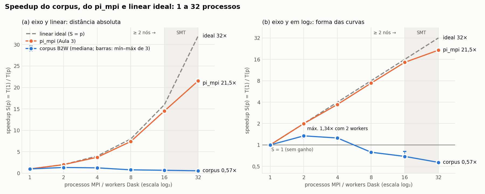
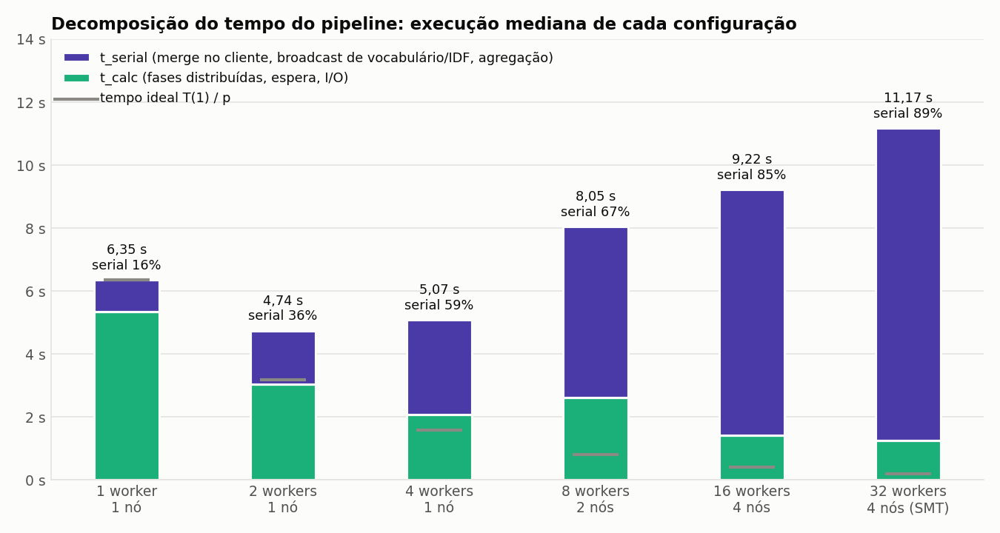
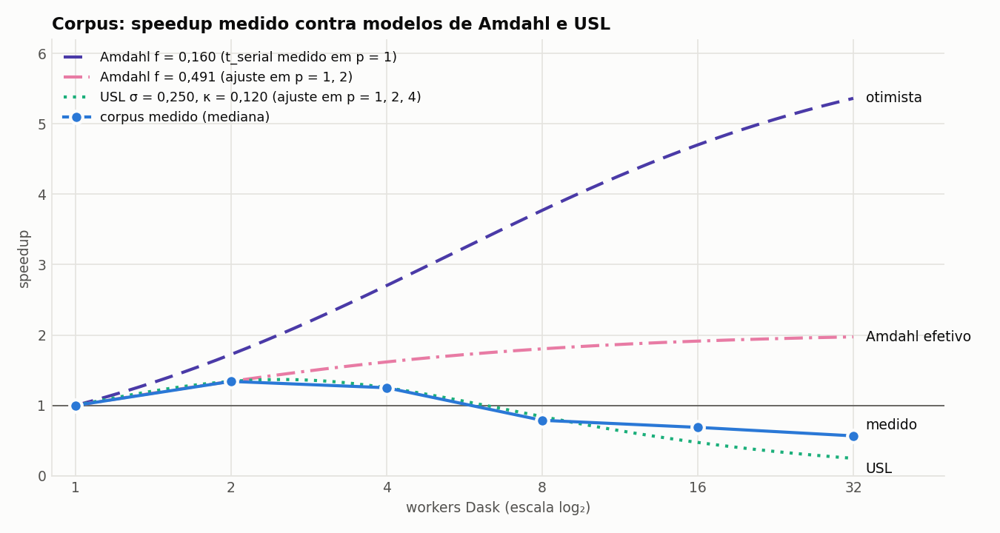

# Análise individual — Vinicius Passos

Pipeline de PLN (B2W-Reviews01, 129.098 documentos, Dask/Slurm) comparado ao `pi_mpi` da Aula 3 e ao linear ideal. Dados: [speedup_corpus.csv](../resultados/speedup_corpus.csv) (mediana de 3 repetições), [speedup.csv](../resultados/speedup.csv) e [medições individuais](../resultados/pipeline/run-20260930-corpus02). Figuras geradas por [graficos.py](graficos.py).

## 1. Resultados

| p | Nós | Corpus T (s) | Corpus S | Corpus E | pi_mpi T (s) | pi_mpi S | pi_mpi E |
| ---: | ---: | ---: | ---: | ---: | ---: | ---: | ---: |
| 1 | 1 | 6,353 | 1,00 | 100% | 34,866 | 1,00 | 100% |
| 2 | 1 | 4,735 | **1,34** | 67% | 17,456 | 2,00 | 100% |
| 4 | 1 | 5,074 | 1,25 | 31% | 9,390 | 3,71 | 93% |
| 8 | 2 | 8,047 | 0,79 | 10% | 4,708 | 7,41 | 93% |
| 16 | 4 | 9,216 | 0,69 | 4% | 2,401 | 14,52 | 91% |
| 32 | 4 (SMT) | 11,173 | 0,57 | 2% | 1,620 | 21,53 | 67% |

`S(p) = T(1)/T(p)`, `E = S/p`. O corpus tem o melhor tempo com **2 workers (1,34×)** e fica **mais lento que 1 worker a partir de 8**. O `pi_mpi` acompanha o ideal até 16 processos. A variação entre repetições do corpus não passa de 8% (16% com 16 workers), e mesmo a repetição mais rápida de 16 workers tem S = 0,81 < 1.

## 2. Speedup: corpus × pi_mpi × linear ideal



- **Ideal × `pi_mpi`:** distância pequena até 16 processos, concentrada em 32 (SMT rende 1,48× em vez de 2×). O programa calcula por 34,9 s e comunica poucos bytes (`t_serial` ≤ 8 ms).
- **`pi_mpi` × corpus:** diferença de 37,8× com 32 processos (21,5× contra 0,57×). O corpus tem só 5,3 s de trabalho útil, em 128 partições de ~42 ms cada. Coordenação e comunicação custam mais que o próprio cálculo.

## 3. Para onde vai o tempo



- **`t_serial` cresce com os workers:** 1,02 s → 9,92 s (16% → 89% do total), cerca de +1,9 s a cada duplicação (`≈ 0,16 + 1,86·log₂p`, R² = 0,97). Com 32 workers, só esse acréscimo (8,9 s) já é maior que o tempo total de 1 worker.
- **`t_calc` escala pouco:** 5,33 s → 1,23 s (4,35×), com piso de ~1,3 s (`≈ 1,34 + 3,89/p`, R² = 0,93).
- **A soma dos dois ajustes tem mínimo em p ≈ 1,5**, o que é compatível com o melhor tempo medido, com 2 workers.

## 4. Gargalos

- **Fração serial.** O cliente faz sozinho o merge dos 128 `Counter` de DF, monta o vocabulário (47.801 termos) e o IDF, e agrega TF-IDF e estatísticas. Com 1 worker isso já é 16% do tempo, o que limita o speedup a 6,2× mesmo que o resto escalasse perfeitamente.
- **Shuffle e serialização.** Os documentos não são embaralhados: os tokens ficam no worker que os leu. A comunicação se resume a reduções no cliente e ao broadcast de vocabulário + IDF (1,12 MB em pickle **por worker**; 35,7 MB com 32). Esse volume leva ~0,33 s no gigabit, mas o acréscimo medido é de 8,9 s. O custo está na coordenação de cada destinatário: `scatter(broadcast=True)` passa pelo scheduler e replica em rodadas, e são dois broadcasts seguidos. No `pi_mpi`, `MPI_Bcast/Reduce` usam buffers contíguos em C, em árvore.
- **Rede gigabit.** No ping-pong da Aula 3, 1 byte leva 199 µs entre nós contra 0,25 µs no mesmo nó (796×), e a vazão é de 107 MB/s. Passar de 4 para 8 workers (1 → 2 nós) é o pior degrau: T sobe 59% e `t_calc` sobe 27% mesmo com o dobro de workers. O limite é latência × número de mensagens, não banda (≤ ~80 MB por repetição, menos de 0,8 s).
- **I/O no NFS.** Leitura de 20,4 MiB de JSONL e escrita de ~21 MB de NPZ, tudo pelo mesmo link do master, então a banda não cresce com os nós. Isso dá um piso de pelo menos ~0,4 s por repetição, relevante diante dos 1,2–1,4 s de `t_calc` com 16–32 workers. Os shards ficam no cache de `c1` (verificação de hash), o que favorece as configurações de um nó.
- **Hyperthreading (16+ workers).** Com 16 workers, os 16 cores físicos estão ocupados e `c1` ainda roda scheduler e cliente, sem pinning. Com 32, `c1` tem ao menos 10 processos para 8 CPUs lógicas. De 16 para 32, `t_calc` ganha só 1,16× (contra 1,48× do `pi_mpi`), enquanto `t_serial` sobe 2,12 s, 11 vezes o que o SMT economizou.

| Composição de T com 32 workers | Tempo (s) |
| --- | ---: |
| Crescimento da coordenação e do broadcast (`t_serial(32) − t_serial(1)`) | 8,90 |
| Trabalho serial fixo no cliente (`t_serial(1)`) | 1,02 |
| Excesso de `t_calc` sobre o ideal: coletas, NFS, cauda, SMT | 1,06 |
| Cálculo ideal (`t_calc(1)/32`) | 0,17 |

## 5. Fração serial pela lei de Amdahl



| Método | f | Limite 1/f |
| --- | ---: | ---: |
| Ajuste da Aula 3 (`1/S` × `1/p`, 6 pontos) | 1,374 | inválido (f > 1) |
| `t_serial/T` medido com 1 worker (otimista) | 0,160 | 6,2× |
| **Amdahl exato em p = 1, 2 (adotado)** | **0,491** | **2,0×** |
| `pi_mpi` (Aula 3) | 0,013 | 75,8× |

**Fração serial efetiva: f ≈ 0,49**, cerca de 37 vezes a do `pi_mpi`. Mesmo com esse f, Amdahl prevê S(32) = 1,97, e o medido foi 0,57. A fração experimental de Karp–Flatt, `e(p) = (1/S − 1/p)/(1 − 1/p)`, mostra por quê:

| p | 2 | 4 | 8 | 16 | 32 |
| --- | ---: | ---: | ---: | ---: | ---: |
| e(p), corpus | 0,491 | 0,732 | 1,305 | 1,481 | 1,783 |
| e(p), `pi_mpi` | 0,001 | 0,026 | 0,012 | 0,007 | 0,016 |

No corpus, `e(p)` cresce e passa de 1 a partir de 8 workers; no `pi_mpi`, fica estável perto de 0,01. Uma fração que cresce com p indica overhead de coordenação, e não código serial fixo, e por isso sai do domínio de Amdahl. A USL (`σ = 0,25`, `κ = 0,12`, ajustada em 1 nó) captura esse overhead e prevê o pico em ~2,5 workers.

## 6. Limitações e reprodução

São 3 repetições em ordem fixa, sem limpar cache. `t_serial` não separa merge de broadcast, então a causa do broadcast é inferida pela conta de volume, e os logs do Dask ficaram no NFS. As figuras podem ser regeneradas com NumPy e Matplotlib ([requirements](../pipeline/requirements.txt)):

```bash
python3 analise/graficos.py
```
