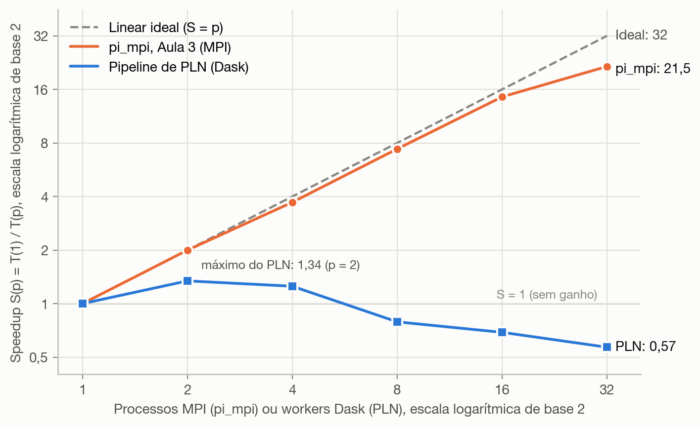
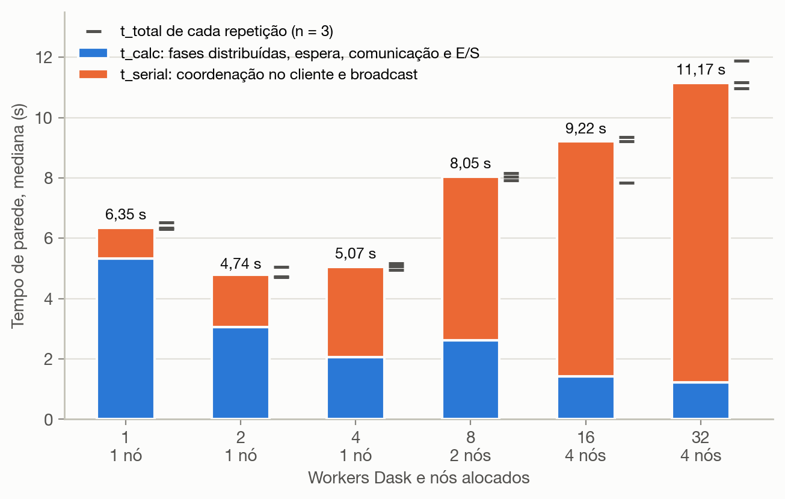
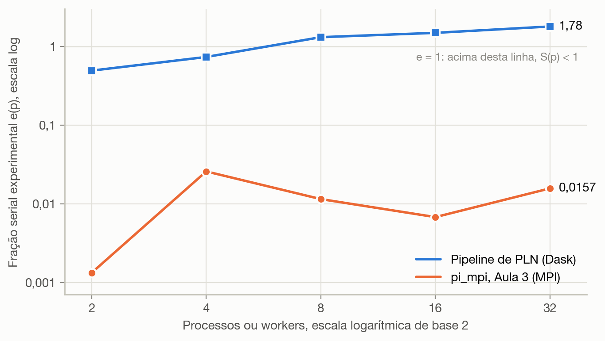
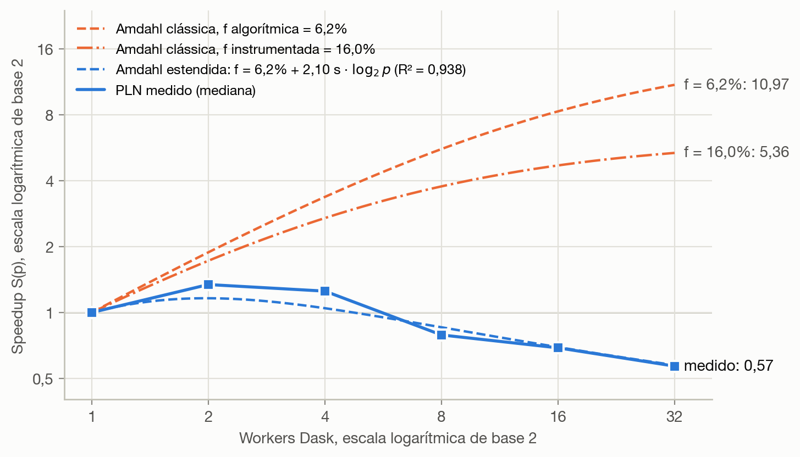
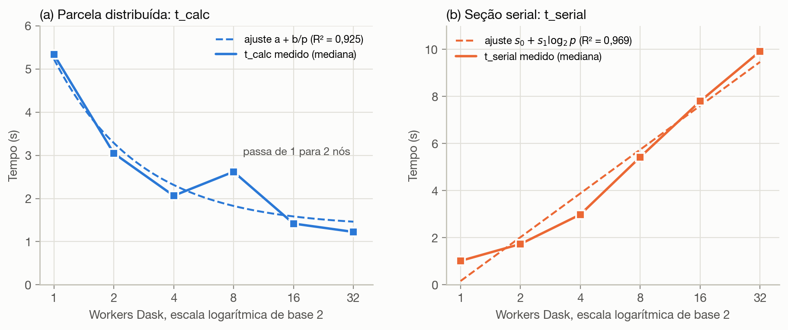

# Análise individual: escalabilidade do pipeline de PLN distribuído

**Autor:** Wildisley Filho

## Resumo

Este documento compara a escalabilidade forte de duas cargas executadas no mesmo cluster de quatro nós: o `pi_mpi` da Aula 3, limitado por computação, e o pipeline de PLN distribuído com Dask sobre o corpus B2W-Reviews01 (129.098 avaliações em português). Com 32 processos, o `pi_mpi` atinge speedup de 21,5. Com 32 workers, o pipeline fica em 0,57, ou seja, é mais lento que a execução com um único worker; seu melhor ponto é 1,34, com dois workers. A decomposição do tempo de parede mostra que a parcela distribuída (`t_calc`) cai de 5,33 s para 1,23 s. Em contrapartida, a seção serial de coordenação (`t_serial`) sobe de 1,02 s para 9,92 s, cerca de 1,86 s a mais a cada duplicação de workers, e responde por 90% do afastamento em relação ao ideal com 32 workers. O volume serializado em cada fase foi medido e combinado com o modelo de latência e banda obtido no ping-pong da Aula 3. Por esse cálculo, a banda da rede gigabit e do NFS explica no máximo 6,5% desse afastamento. Pela Lei de Amdahl, a fração serial efetiva estimada no melhor ponto é f ≈ 0,49, 37 vezes a do `pi_mpi` (0,0132), enquanto a fração serial algorítmica medida é de apenas 6,2%. A diferença é uma sobrecarga que cresce com o número de workers e que o modelo de Amdahl não contempla. Um modelo estendido, com f = 6,2% e sobrecarga de 2,10 s por duplicação, reproduz a curva medida (R² = 0,938) e prevê número ótimo de workers p* ≈ 2,0, que coincide com o observado.

**Palavras-chave:** speedup; Lei de Amdahl; métrica de Karp–Flatt; Dask; TF-IDF; NFS.

## 1 Introdução

A Parte 2 da atividade pediu um pipeline de PLN distribuído com quatro etapas (tokenização, remoção de stopwords, vetorização TF-IDF e estatísticas do corpus), submetido via Slurm com 1, 2, 4, 8, 16 e 32 workers. A implementação do grupo está descrita em [pipeline/RELATORIO.md](../pipeline/RELATORIO.md). Conforme o enunciado, esta análise individual tem três objetivos: (i) comparar, em um mesmo gráfico, o speedup do pipeline, o do `pi_mpi` da Aula 3 e o linear ideal; (ii) discutir os gargalos que explicam a distância entre as curvas (E/S no NFS, shuffle e serialização, rede gigabit, hyperthreading a partir de 16 workers e fração serial); e (iii) estimar a fração serial do pipeline pela Lei de Amdahl.

Além desses itens, o documento traz análises complementares construídas a partir dos dados do experimento:

- a decomposição do tempo de parede;
- a métrica de Karp–Flatt;
- um modelo de Amdahl estendido com termo de sobrecarga;
- um orçamento de comunicação, baseado no modelo de Hockney e no volume serializado de cada fase;
- as leis de escala de cada componente do tempo;
- a granularidade das tarefas;
- a variabilidade entre repetições.

## 2 Materiais e métodos

### 2.1 Ambiente experimental

O cluster OpenHPC/Slurm tem quatro nós de computação (`c1` a `c4`). Cada nó tem quatro núcleos físicos com duas threads de hardware por núcleo (SMT), o que totaliza 16 núcleos físicos e 32 CPUs lógicas. Os nós se comunicam por Ethernet gigabit. O NFS exporta `/opt/ohpc/pub`, onde está o dataset (somente leitura nos nós), e `/home`, onde ficam o código e as saídas. No Bloco 2 da Aula 3, o ping-pong entre `c1` e `c2` mediu ida e volta de 199,07 µs para 1 byte e vazão de 107,4 MB/s para 1 MiB ([resultados/bloco2-pingpong.csv](../resultados/bloco2-pingpong.csv)).

As duas cargas usaram a mesma topologia: 1, 2 e 4 processos em um nó, 8 em dois nós, e 16 e 32 em quatro nós (quatro e oito processos por nó, respectivamente). O `pi_mpi` estima π por Monte Carlo com 4×10⁹ pontos. O pipeline processa 129.098 documentos divididos em 128 partições JSONL (21,43 MB), com Dask Distributed 2026.8.0 (ROCKLIN, 2015), Python 3.11.16 e uma thread por worker. O script de lote do Slurm executa no primeiro nó da alocação, `c1`, e com ele executam também o scheduler do Dask e o processo cliente que coordena o pipeline.

### 2.2 Métricas e modelos

Seja T(p) o tempo de parede com p processos ou workers. O speedup e a eficiência são definidos por

$$S(p) = \frac{T(1)}{T(p)}, \qquad E(p) = \frac{S(p)}{p}.$$

A Lei de Amdahl (AMDAHL, 1967) supõe que uma fração f do trabalho é estritamente serial e que o restante é perfeitamente paralelizável:

$$S_{\text{Amdahl}}(p) = \frac{1}{f + (1-f)/p}, \qquad \lim_{p \to \infty} S_{\text{Amdahl}}(p) = \frac{1}{f}.$$

A métrica de Karp–Flatt (KARP; FLATT, 1990) inverte essa relação e calcula, para cada p, a fração serial determinada experimentalmente:

$$e(p) = \frac{1/S(p) - 1/p}{1 - 1/p}.$$

Se e(p) se mantém aproximadamente constante, a perda de eficiência decorre de uma fração serial intrínseca. Se e(p) cresce com p, há uma sobrecarga paralela que aumenta com o número de processos. Para representar essa sobrecarga, este trabalho usa um modelo de Amdahl estendido com um termo logarítmico, forma típica de operações coletivas organizadas em rodadas:

$$T(p) = T(1)\left[f + \frac{1-f}{p}\right] + c \log_2 p.$$

Por fim, o custo de transmitir n bytes entre nós é aproximado pelo modelo de Hockney (HOCKNEY, 1994), t(n) = α + n/β. Com os dados do Bloco 2, tem-se α ≈ 99,5 µs (metade da ida e volta de 1 byte) e β ≈ 107,4 MB/s.

### 2.3 Fontes de dados e procedimentos

Os tempos do pipeline são as medianas de três repetições por configuração, registradas em [resultados/speedup_corpus.csv](../resultados/speedup_corpus.csv). O script desta análise confere que essas medianas coincidem com os 18 arquivos `measurement.json` do lote. Os tempos do `pi_mpi` vêm de [resultados/speedup.csv](../resultados/speedup.csv), que registra o menor tempo entre duas séries, conforme o roteiro da Aula 3. Em cada execução do pipeline, `t_total = t_serial + t_calc`, em que:

- `t_serial` mede os trechos executados no cliente entre as fases distribuídas: combinação das frequências documentais, construção do vocabulário e do IDF, broadcast de ambos aos workers e agregação final das estatísticas;
- `t_calc` é o restante do tempo de parede: as fases distribuídas (leitura, tokenização, remoção de stopwords, vetorização e escrita das matrizes no NFS), incluindo espera e comunicação.

Para quantificar o volume de dados trocado em cada fase, as funções de [pipeline/pipeline.py](../pipeline/pipeline.py) foram reexecutadas fora do cluster, em sequência e sem Dask, sobre o mesmo dataset; os SHA-256 das 129 partições conferem com [pipeline/dataset-manifest.json](../pipeline/dataset-manifest.json). Os tamanhos registrados são os do pickle (protocolo 5, sem compressão) e não dependem do hardware. Os tempos de CPU, medianas de três execuções em um Apple M4 com Python 3.9.6, servem apenas para estimar a proporção entre as fases. Os scripts [medir_volumes.py](wildisley-filho/medir_volumes.py) e [analise.py](wildisley-filho/analise.py) reproduzem todos os números e figuras deste documento (Apêndice A).

### 2.4 Convenção gráfica

Todas as figuras usam apenas duas cores. O azul representa sempre o pipeline de PLN ou a sua parcela distribuída, e o laranja representa o termo com que ele é comparado em cada figura:

- **Figuras 1 e 3:** azul para o pipeline de PLN e laranja para o `pi_mpi` da Aula 3;
- **Figuras 2 e 5:** azul para `t_calc`, a parcela distribuída, e laranja para `t_serial`, a seção serial;
- **Figura 4:** azul para o pipeline medido e para o modelo de Amdahl estendido, e laranja para as previsões da Lei de Amdahl clássica.

O cinza neutro fica reservado ao linear ideal e às linhas horizontais de referência (S = 1 ou e = 1). Linhas contínuas com marcadores representam valores medidos, e linhas tracejadas representam curvas teóricas ou ajustadas. Os marcadores quadrados identificam o pipeline, e os circulares, o `pi_mpi`. O par azul e laranja foi verificado quanto à distinção para as formas mais comuns de daltonismo, e cada curva tem também legenda ou rótulo direto, de modo que a identificação não depende só da cor.

## 3 Resultados

### 3.1 Curvas de speedup

A Figura 1 apresenta as três curvas exigidas: o speedup do pipeline de PLN, o do `pi_mpi` da Aula 3 e o linear ideal. Os dois eixos estão em escala logarítmica de base 2; assim, o ideal aparece como uma reta diagonal, e valores de speedup menores que 1 continuam visíveis.

**Figura 1 — Speedup do pipeline de PLN, do `pi_mpi` e linear ideal**



Fonte: elaborada pelo autor com dados de `resultados/speedup.csv` e `resultados/speedup_corpus.csv`.

A Figura 1 mostra que o `pi_mpi` acompanha o ideal até 16 processos, com eficiência de 90,8%, e só se afasta dele em 32, quando atinge speedup de 21,5 (eficiência de 67,3%). O pipeline de PLN se comporta de modo qualitativamente diferente. Seu speedup atinge o máximo de 1,34 com dois workers, recua para 1,25 com quatro e fica abaixo de 1 a partir de oito workers, chegando a 0,57 com 32. Nesse ponto, a execução distribuída é 1,76 vez mais lenta que a execução com um único worker.

A distância em relação ao ideal, portanto, não é apenas maior: é de outra natureza. O `pi_mpi` perde eficiência de forma gradual, enquanto o pipeline perde desempenho em termos absolutos. A Tabela 1 detalha esses valores e acrescenta o speedup da parcela distribuída, S_calc(p) = t_calc(1)/t_calc(p), discutido na Seção 3.2.

**Tabela 1 — Speedup e eficiência das duas cargas**

| p | Nós | pi_mpi: S | pi_mpi: E | PLN: T (s) | PLN: S | PLN: E | PLN: S_calc |
|---:|---:|---:|---:|---:|---:|---:|---:|
| 1 | 1 | 1,000 | 100,0% | 6,353 | 1,000 | 100,0% | 1,000 |
| 2 | 1 | 1,997 | 99,9% | 4,735 | 1,342 | 67,1% | 1,751 |
| 4 | 1 | 3,713 | 92,8% | 5,074 | 1,252 | 31,3% | 2,585 |
| 8 | 2 | 7,405 | 92,6% | 8,047 | 0,790 | 9,9% | 2,037 |
| 16 | 4 | 14,523 | 90,8% | 9,216 | 0,689 | 4,3% | 3,760 |
| 32 | 4 | 21,525 | 67,3% | 11,173 | 0,569 | 1,8% | 4,352 |

Fonte: elaborada pelo autor. Para o PLN, T é a mediana de `t_total`, e S_calc usa a mediana de `t_calc`.

### 3.2 Decomposição do tempo de parede

A Figura 2 apresenta, para cada configuração, as medianas de `t_calc` e de `t_serial` em barras empilhadas, com o `t_total` de cada repetição indicado por um traço horizontal ao lado da barra. Como cada parcela é uma mediana calculada separadamente, a altura da barra pode diferir em até 0,03 s da mediana de `t_total` indicada no rótulo.

**Figura 2 — Decomposição do tempo de parede do pipeline em parcela distribuída e seção serial**



Fonte: elaborada pelo autor com dados de `resultados/speedup_corpus.csv` e dos arquivos `measurement.json` do lote.

A Figura 2 mostra que o pipeline combina dois comportamentos opostos. A parcela distribuída diminui com o número de workers: `t_calc` cai de 5,33 s para 1,23 s, um speedup de 4,35 que, embora distante de 32, é real. A seção serial, por outro lado, aumenta continuamente: vai de 1,02 s com um worker para 9,92 s com 32, multiplicando-se por 9,7. Sua participação no tempo total passa de 16,0% (p = 1) para 36,6%, 58,9%, 67,5% e 84,6%, até chegar a 88,8% (p = 32).

O melhor tempo, com dois workers, corresponde ao ponto em que o ganho em `t_calc` (−2,29 s) ainda supera o aumento em `t_serial` (+0,72 s). A partir de quatro workers, o aumento da seção serial passa a anular o ganho da parcela distribuída. A dispersão entre repetições é pequena diante dessas tendências; a maior ocorre com 16 workers e é discutida na Seção 6.3.

Com p = 32, o afastamento em relação ao ideal é T(32) − T(1)/32 = 10,97 s. Dele, 9,88 s (90%) vêm da seção serial, t_serial(32) − t_serial(1)/32, e 1,06 s (10%) vêm da parcela distribuída, t_calc(32) − t_calc(1)/32. Qualquer explicação da distância entre as curvas da Figura 1 precisa, portanto, explicar sobretudo o crescimento de `t_serial`.

## 4 Discussão dos gargalos

Esta seção examina os cinco gargalos na ordem do enunciado e confronta, para cada um, o mecanismo físico com as evidências quantitativas disponíveis.

### 4.1 E/S no NFS

Cada execução lê as 128 partições (21,43 MB) de `/opt/ohpc/pub` e grava 128 matrizes NPZ comprimidas (15,85 MB, segundo a medição local) em `/home`, e os dois diretórios são servidos por NFS. Como há um único servidor NFS, esse volume atravessa o mesmo enlace gigabit, qualquer que seja o número de workers. Pelo modelo de Hockney, isso impõe um piso de pelo menos (21,43 + 15,85) MB / 107,4 MB/s ≈ 0,35 s por execução. Esse piso não diminui com p e, por isso, se comporta como uma parcela serial dentro de `t_calc`: representa 6,5% de `t_calc` com um worker e 28% com 32. O efeito é pequeno em termos absolutos, mas pesa cada vez mais à medida que o cálculo se divide. É o fenômeno previsto na quinta resposta da Aula 3: dividir a leitura entre mais processos não multiplica a capacidade do servidor NFS.

Os dados trazem um indício direto desse custo. Nas configurações com até oito workers, a primeira repetição é sistematicamente mais lenta que a média das duas seguintes, por uma margem de 0,14 s a 0,32 s (Tabela 5). Com um worker, a diferença é de 0,20 s. Esse valor tem a mesma ordem de grandeza do tempo de leitura dos 21,43 MB pela rede antes que o cache de páginas do cliente NFS os retenha (0,20 s a 107,4 MB/s), embora o aquecimento dos workers, como a importação do módulo do pipeline, também possa contribuir. A E/S no NFS é, assim, um gargalo real, mas secundário: seu limite inferior equivale a cerca de 3% do afastamento total em p = 32.

### 4.2 Shuffle e serialização

O pipeline não realiza um shuffle todos-para-todos em sentido estrito, como um `groupby` que redistribui registros por chave. Seu padrão de comunicação é mais simples, porém centralizado. O IDF global exige uma barreira de sincronização entre as duas fases distribuídas, em três passos:

1. cada partição produz suas frequências documentais, que são reunidas no cliente (*gather*, todos-para-um);
2. o cliente combina as 128 contagens, constrói o vocabulário e o IDF e os replica em todos os workers (*broadcast*, um-para-todos);
3. cada partição é vetorizada, e as somas parciais de TF-IDF voltam ao cliente em um segundo *gather*.

A Tabela 2 apresenta o volume serializado de cada fase, medido com o dataset real, e o tempo mínimo de transmissão correspondente com 32 workers.

**Tabela 2 — Volume serializado por fase e limite inferior do tempo de transmissão (modelo de Hockney)**

| Fase | Volume por execução | Tráfego entre nós em p = 32 | Tempo mínimo em p = 32 (s) |
|---|---:|---:|---:|
| Leitura das partições (NFS) | 21,43 MB | 21,43 MB | 0,200 |
| Escrita das matrizes NPZ (NFS) | 15,85 MB | 15,85 MB | 0,148 |
| *Gather* de frequências e comprimentos | 6,19 MB | 4,64 MB | 0,043 |
| Broadcast de vocabulário (0,73 MB) e IDF (0,38 MB) | 1,12 MB por cópia | 26,76 MB (24 cópias remotas) | 0,249 |
| *Gather* das somas de TF-IDF | 10,09 MB | 7,57 MB | 0,070 |
| **Total** | — | **76,25 MB** | **0,710** |

Fonte: elaborada pelo autor. Volumes medidos com `analise/wildisley-filho/medir_volumes.py` (pickle, protocolo 5); tempo = volume/β, com β = 107,4 MB/s (Bloco 2 da Aula 3). Como cliente e scheduler ficam em `c1`, considerou-se remoto 3/4 do volume dos *gathers*.

A Tabela 2 mostra que os objetos trocados são pequenos: 457.818 entradas de frequência documental e outras 457.818 somas parciais, todas em estruturas Python (`Counter` e `dict`) serializadas por pickle. A serialização em si também é barata: localmente, serializar e desserializar o vocabulário leva 3,7 ms e 4,0 ms, respectivamente. As 31 réplicas do broadcast em p = 32 somariam cerca de 0,24 s de CPU, distribuídos entre os workers. O problema não está, portanto, no custo unitário da serialização, e sim no fato de toda a comunicação passar por um único ponto: o cliente recebe e combina todas as parciais, e o scheduler coordena cada réplica do broadcast. O relatório do grupo registra uma incompatibilidade entre o broadcast e a política `ReduceReplicas` do *Active Memory Manager*, o que confirma que essas réplicas são objetos geridos pelo scheduler.

Há ainda um efeito de redistribuição. A distribuição de partições por nó variou entre repetições (por exemplo, 70/58 em vez de 64/64 com oito workers), o que indica que o scheduler moveu tarefas entre nós. Quando uma vetorização executa em um nó diferente daquele que pré-processou a partição, o estado intermediário (191 KB em média) também precisa ser transferido.

### 4.3 Rede gigabit

A Aula 3 caracterizou dois regimes da rede. Com mensagens grandes, a vazão chega a 107,4 MB/s, 86% do valor nominal. Com mensagens pequenas, atravessar o switch custa 796 vezes mais que comunicar dentro do nó (199,07 µs contra 0,25 µs de ida e volta). No regime de banda, a Tabela 2 limita o impacto da rede: mesmo que os 76,25 MB trafegassem em série por um único enlace, a transmissão levaria 0,71 s, ou 6,5% dos 10,97 s de afastamento em p = 32. A banda do gigabit, portanto, não explica o comportamento observado.

A travessia da rede, no entanto, aparece nos dados. Ao passar de quatro workers em um nó para oito em dois nós, `t_calc` sobe de 2,06 s para 2,62 s (+27%), apesar do dobro de workers, e `t_serial` tem seu maior incremento (+2,44 s). É o único ponto em que a parcela distribuída piora (Figura 2). A explicação mais coerente com o Bloco 2 é o regime de latência. A coordenação do Dask consiste em muitas mensagens pequenas de controle (atribuição e conclusão de tarefas, localização de dados, pedidos de réplica), e cada uma paga cerca de 100 µs de latência de rede, além da latência de software nas duas pontas. No `pi_mpi`, ao contrário, a rede praticamente não aparece: há três operações coletivas por execução, com cargas de poucos bytes, e `t_serial` não passa de 7,9 ms.

### 4.4 Hyperthreading a partir de 16 workers

Com 16 workers, cada nó recebe quatro, um por núcleo físico. Mesmo assim, o nó `c1` já opera acima de sua capacidade física, pois hospeda também o scheduler, o cliente e os processos *nanny* que o `dask worker` cria para supervisionar cada worker. Esses processos passam a disputar núcleos com os workers. A seção serial, que roda no cliente e no scheduler, é justamente a mais sensível a essa disputa. Com 32 workers, cada nó recebe oito, e todas as CPUs lógicas passam a ser usadas via SMT. As duas threads de um núcleo compartilham unidades de execução, caches e largura de banda de memória, e por isso o ganho do SMT fica tipicamente bem abaixo de 2× (MARR et al., 2002).

Os dados confirmam esse limite nas duas cargas. De 16 para 32, o `pi_mpi` ganha 1,48× em vez de 2×, e sua eficiência cai de 90,8% para 67,3%. No pipeline, a parcela distribuída ganha apenas 1,16× (`t_calc` passa de 1,42 s para 1,23 s), um ganho ainda menor, compatível com código Python interpretado e dominado por acessos a tabelas hash. Ao mesmo tempo, `t_serial` aumenta 2,12 s sem que nenhum nó seja adicionado, o que mostra que o custo de coordenação cresce com o número de workers, e não apenas com o de nós. Como resultado, o tempo total piora 21%, de 9,22 s para 11,17 s. O hyperthreading, portanto, explica a queda de eficiência do `pi_mpi` com 32 processos, mas é um fator secundário no pipeline, diante do custo de coordenação.

### 4.5 Fração serial

A seção serial é o gargalo dominante. Seu trabalho algorítmico não depende de p: o cliente combina sempre as mesmas 128 parciais, com as mesmas 457.818 entradas, e constrói o mesmo vocabulário de 47.801 termos. Na medição local, essa computação consome 0,175 s de CPU, uma fração serial algorítmica de 6,2% do trabalho total. Já com um worker, o `t_serial` medido no cluster (1,02 s) é 5,8 vezes esse valor, enquanto `t_calc` é apenas 2,0 vezes o tempo local equivalente. Isso indica um custo fixo de coordenação que existe antes mesmo de haver paralelismo. A partir daí, `t_serial` cresce até 9,92 s. Esse crescimento não pode ser atribuído à computação, que é constante, nem à banda de rede, que responde por no máximo 0,25 s do broadcast (Tabela 2), nem à serialização, que custa cerca de 0,24 s de CPU.

Restam os custos de protocolo e de coordenação do Dask, que a instrumentação atual não separa:

- as rodadas de replicação do broadcast, conduzidas pelo scheduler;
- a latência das chamadas remotas em um laço de eventos único, sob um número crescente de conexões;
- a disputa por CPU em `c1`.

A Seção 6.1 mostra que `t_serial` cresce de forma aproximadamente linear em log₂ p (R² = 0,969), padrão compatível com operações organizadas em rodadas cujo número cresce com o logaritmo de p. Essa compatibilidade, porém, não prova o mecanismo; para isso, seria necessário um perfil do scheduler (Seção 7).

### 4.6 Síntese

A Tabela 3 reúne as estimativas desta seção e ordena os gargalos pela contribuição ao afastamento de 10,97 s observado com 32 workers.

**Tabela 3 — Contribuição estimada de cada gargalo ao afastamento do ideal em p = 32**

| Gargalo | Evidência principal | Contribuição estimada |
|---|---|---|
| Fração serial (coordenação centralizada) | `t_serial` cresce 1,86 s por duplicação; o cálculo serial é constante | ≈ 9,9 s (90%) |
| E/S no NFS | Piso de 37,3 MB por execução, servidos por um único servidor | ≥ 0,35 s (≥ 3%) |
| Rede gigabit (banda) | Tabela 2: 76,25 MB trafegados em p = 32 | ≤ 0,71 s (≤ 6,5%), sobreposta às linhas acima |
| Rede gigabit (latência) | Salto de `t_calc` e `t_serial` de 4 para 8 workers | Não isolável; concentrada em `t_serial` |
| Shuffle e serialização | 16,3 MB em *gathers* e 1,12 MB por réplica | ≈ 0,2–0,3 s de CPU; efeito maior via centralização |
| Hyperthreading (SMT) | `t_calc` ganha 1,16× de 16 para 32 workers | Parte do excesso de 1,06 s em `t_calc` |

Fonte: elaborada pelo autor. As contribuições não são aditivas: a banda de rede se sobrepõe à E/S no NFS e ao broadcast.

A Tabela 3 mostra que a distância entre as curvas da Figura 1 se explica principalmente pela arquitetura de coordenação do pipeline, e não pelos limites físicos do hardware. Rede, NFS e SMT têm efeitos mensuráveis, mas, somados, ficam uma ordem de grandeza abaixo do crescimento da seção serial.

## 5 Estimativa da fração serial pela Lei de Amdahl

A Lei de Amdahl pressupõe que f é constante e que a parcela 1 − f se divide perfeitamente. Nesse modelo, S(p) nunca é menor que 1. Como o pipeline chega a S = 0,57, nenhum valor de f entre 0 e 1 reproduz a curva inteira, e a estimativa passa a depender do método. A Tabela 4 compara as estimativas obtidas por diferentes métodos e aplica ao `pi_mpi` o mesmo ajuste usado na Aula 3, como referência.

**Tabela 4 — Estimativas da fração serial**

| Método | Carga | f estimada | Limite 1/f | S(32) previsto | Observação |
|---|---|---:|---:|---:|---|
| MMQ de 1/S contra 1/p, seis pontos (método da Aula 3) | pi_mpi | 1,32% | 75,8 | 22,71 | R² = 0,9998 |
| MMQ de 1/S contra 1/p, seis pontos | PLN | fora de [0, 1] | — | — | Inclinação negativa (1 − f = −0,62); R² = 0,34 |
| MMQ de 1/S contra 1/p, apenas um nó (p ≤ 4) | PLN | 67,1% | 1,49 | 1,47 | R² = 0,74 |
| Amdahl invertida no melhor ponto, e(2) | PLN | 49,1% | 2,04 | 1,97 | Exata em p = 2 |
| Instrumentada: t_serial(1)/t_total(1) | PLN | 16,0% | 6,24 | 5,36 | Inclui coordenação fixa |
| Algorítmica: CPU serial/CPU total (medição local) | PLN | 6,2% | 16,2 | 10,97 | Apenas computação |

Fonte: elaborada pelo autor. MMQ: mínimos quadrados. S(32) medido: 21,53 (pi_mpi) e 0,569 (PLN).

Aplicado ao pipeline, o método da Aula 3 não produz uma fração válida. Como 1/S aumenta quando 1/p diminui, a reta ajustada tem inclinação negativa, e o intercepto (1,37) não pode ser interpretado como fração. As demais estimativas vão de 6,2% a 67,1%, e todas superestimam S(32), algumas em mais de uma ordem de grandeza.

A fração que melhor descreve o pipeline no regime em que ele de fato acelera é a obtida no melhor ponto: **f ≈ 0,49**, com limite teórico S_max ≈ 2,0. Esse valor é cerca de 37 vezes a fração do `pi_mpi` (0,0132). Ainda assim, ele prevê S(32) = 1,97, três vezes e meia o valor medido. A métrica de Karp–Flatt, apresentada na Figura 3, explica essa discrepância ao calcular a fração serial implícita em cada ponto medido.

**Figura 3 — Fração serial determinada experimentalmente (métrica de Karp–Flatt) nas duas cargas**



Fonte: elaborada pelo autor com dados da Tabela 1. Eixo horizontal em escala logarítmica de base 2; eixo vertical em escala logarítmica de base 10.

Na Figura 3, as duas cargas ocupam regimes separados por cerca de duas ordens de grandeza. No `pi_mpi`, e(p) oscila entre 0,0013 e 0,026, sem tendência definida, que é o comportamento esperado de uma fração serial intrínseca pequena, para a qual a Lei de Amdahl é adequada. No pipeline, e(p) cresce monotonicamente com p: 0,49, 0,73, 1,31, 1,48 e 1,78. Segundo a interpretação de Karp e Flatt (1990), uma fração serial que cresce com p indica sobrecarga paralela que aumenta com o número de processadores, e não uma parcela serial fixa. Os valores maiores que 1 a partir de oito workers mostram que o pipeline sai do domínio da Lei de Amdahl: uma fração serial acima de 100% não tem interpretação física e apenas traduz o fato de que S(p) < 1.

Para descrever a curva, é preciso separar a fração serial da sobrecarga. A Figura 4 compara o speedup medido com três modelos: Amdahl com a fração algorítmica (6,2%), Amdahl com a fração instrumentada (16,0%) e o modelo estendido da Seção 2.2. No modelo estendido, f foi fixada em 6,2%, e apenas o coeficiente de sobrecarga c foi ajustado por mínimos quadrados.

**Figura 4 — Speedup medido do pipeline e previsões da Lei de Amdahl clássica e estendida**



Fonte: elaborada pelo autor com dados de `resultados/speedup_corpus.csv` e `analise/wildisley-filho/volumes_locais.json`. Eixos em escala logarítmica de base 2.

A Figura 4 mostra que a Lei de Amdahl clássica erra tanto a forma quanto a ordem de grandeza da curva: com f = 6,2% ou 16,0%, ela prevê speedups crescentes, de 10,97 e 5,36 em p = 32. O modelo estendido, com c = 2,10 s por duplicação de workers, reproduz o máximo em p = 2, a queda para valores abaixo de 1 e o valor final (0,575 previsto contra 0,569 medido), com R² = 0,938 sobre T(p). O coeficiente ajustado é próximo da inclinação medida diretamente em `t_serial` (1,86 s por duplicação; Seção 6.1), o que indica que a sobrecarga do modelo corresponde à coordenação observada. Derivando T(p) e igualando a derivada a zero, obtém-se o número ótimo de workers:

$$p^{*} = \frac{T(1)\,(1-f)\,\ln 2}{c} = \frac{6{,}353 \times 0{,}938 \times 0{,}693}{2{,}10} \approx 1{,}97.$$

O valor coincide com a configuração de melhor desempenho medida, p = 2. A conclusão também não depende da escolha de f: com f = 16,0%, obtêm-se c = 1,94 s, R² = 0,920 e p* = 1,90.

Um resultado metodológico merece registro. Quando f e c são ajustados simultaneamente, com f restrita ao intervalo [0, 1], o ajuste converge para a fronteira f = 0 (c = 2,19 s; R² = 0,947). Com apenas seis pontos e uma sobrecarga dessa magnitude, os tempos totais não permitem identificar f, porque o termo c·log₂ p absorve todo o efeito serial. Por isso a medição independente da fração algorítmica é necessária.

Em síntese, a estimativa pedida pode ser expressa em dois níveis:

- a **fração serial efetiva de Amdahl** do pipeline, estimada no ponto de melhor desempenho, é f ≈ 0,49; ela não é constante e deixa de ser válida a partir de oito workers;
- a **fração serial estrutural** fica entre 6,2% (computação) e 16,0% (seção serial instrumentada com um worker).

A diferença entre os dois níveis é a sobrecarga de coordenação, de cerca de 2,1 s por duplicação de workers.

## 6 Análises complementares

### 6.1 Leis de escala das componentes do tempo

A Figura 5 apresenta separadamente cada componente do tempo de parede do pipeline, junto com o ajuste do modelo que melhor a descreve: uma lei de Amdahl, a + b/p, para a parcela distribuída (painel a), e uma lei logarítmica, s₀ + s₁ log₂ p, para a seção serial (painel b).

**Figura 5 — Leis de escala das componentes do tempo de parede do pipeline**



Fonte: elaborada pelo autor com dados de `resultados/speedup_corpus.csv`. Eixos horizontais em escala logarítmica de base 2.

No painel (a) da Figura 5, a parcela distribuída segue de perto uma lei de Amdahl própria, t_calc(p) ≈ 1,34 + 3,89/p (R² = 0,925). Isso equivale a uma fração não paralelizável de 26% dentro da própria parcela distribuída, com piso de 1,34 s. O piso reúne o limite de E/S no NFS (≥ 0,35 s; Seção 4.1), os *gathers* para o cliente e a espera pela tarefa mais lenta de cada fase. Assim, mesmo que a seção serial não existisse, o speedup do pipeline ficaria em torno de 4 com 32 workers (S_calc = 4,35, eficiência de 13,6%). O único ponto claramente acima do ajuste é p = 8, a primeira configuração com dois nós, o que reforça o papel da travessia da rede discutido na Seção 4.3.

No painel (b), a seção serial cresce de forma aproximadamente linear com o logaritmo do número de workers: t_serial(p) ≈ 0,16 + 1,86 log₂ p (R² = 0,969). Os incrementos a cada duplicação são 0,72 s, 1,25 s, 2,44 s, 2,37 s e 2,12 s. Os três maiores ocorrem a partir de oito workers, quando a coordenação passa a atravessar a rede. O incremento de 16 para 32 workers, no mesmo conjunto de quatro nós, mostra ainda que o custo depende do número de workers, e não só do número de nós. O ajuste subestima o valor em p = 1 (0,16 s contra 1,02 s medido), o que é coerente com o custo fixo de coordenação identificado na Seção 4.5.

### 6.2 Granularidade e razão entre trabalho e coordenação

Com um worker, `t_calc` se distribui por 256 tarefas substantivas (128 de pré-processamento e 128 de vetorização), com média de 20,8 ms por tarefa. A documentação do Dask estima a sobrecarga do scheduler entre 200 µs e 1 ms por tarefa (DASK DEVELOPMENT TEAM, 2026), o que corresponde a 1% a 5% desse tempo. A sobrecarga por tarefa, portanto, não é o problema. O problema é o tamanho total do trabalho, pequeno diante dos custos globais de sincronização. Com 32 workers, cada worker processa apenas quatro partições, e o tempo ideal de cálculo por worker seria 0,17 s, abaixo do custo fixo de coordenação medido com um único worker (1,02 s).

A comparação com o `pi_mpi` evidencia a diferença de escala. Como indicador, pode-se usar a razão entre o trabalho sequencial e o custo da seção serial com 32 processos, R = T(1)/t_serial(32). O `pi_mpi` tem R ≈ 34,87/0,0079 ≈ 4.400, e o pipeline, R ≈ 6,35/9,92 ≈ 0,64, uma diferença de quase quatro ordens de grandeza. O `pi_mpi` executa bilhões de operações independentes e se comunica três vezes, com mensagens de poucos bytes. O pipeline tem cerca de 6 s de trabalho sequencial e, entre suas duas fases distribuídas, uma barreira global cujo custo cresce com p.

Essa leitura permite uma projeção no espírito da escalabilidade fraca de Gustafson (1988). Mantidos f = 6,2% e c = 2,10 s, o ótimo p* só chegaria a 32 com T(1) ≈ 103 s, cerca de 16 vezes o trabalho atual, o equivalente a aproximadamente 2,1 milhões de documentos com o mesmo perfil. Mesmo nesse caso, o speedup previsto com 32 workers seria de apenas 5,2, porque a fração algorítmica de 6,2% impõe o teto 1/f ≈ 16. A projeção é apenas indicativa, já que, com mais dados, também crescem o vocabulário a replicar e a combinação serial. Ainda assim, ela mostra que aumentar o corpus não basta: também é preciso descentralizar a seção serial.

### 6.3 Variabilidade entre repetições e efeitos de ordem

A Tabela 5 apresenta, para cada configuração, os valores mínimo, mediano e máximo de `t_total` nas três repetições, o coeficiente de variação (CV) de cada componente e a diferença entre a primeira repetição e a média das duas seguintes.

**Tabela 5 — Dispersão das três repetições por configuração**

| p | t_total: mín. / mediana / máx. (s) | CV t_total | CV t_serial | CV t_calc | 1ª rep. − média das demais (s) | Partições por nó (1ª rep.) |
|---:|---|---:|---:|---:|---:|---|
| 1 | 6,307 / 6,353 / 6,532 | 1,9% | 1,1% | 2,0% | +0,202 | 128 |
| 2 | 4,710 / 4,735 / 5,046 | 3,9% | 2,5% | 5,0% | +0,324 | 128 |
| 4 | 4,960 / 5,074 / 5,159 | 2,0% | 0,5% | 4,7% | +0,142 | 128 |
| 8 | 7,918 / 8,047 / 8,164 | 1,5% | 0,9% | 2,8% | +0,181 | 64 / 64 |
| 16 | 7,833 / 9,216 / 9,346 | 9,5% | 12,2% | 3,8% | −1,448 | 32 / 32 / 32 / 32 |
| 32 | 10,968 / 11,173 / 11,882 | 4,2% | 5,0% | 2,7% | −0,560 | 32 / 32 / 32 / 32 |

Fonte: elaborada pelo autor com os 18 arquivos `measurement.json` do lote `run-20260930-corpus02`.

A Tabela 5 mostra variabilidade baixa, com CV de `t_total` de até 4,2%, exceto com 16 workers. Nessa configuração, a primeira repetição (7,83 s) foi 1,45 s mais rápida que as demais, com quase toda a diferença concentrada em `t_serial`. Há dois padrões de ordem. Até oito workers, a primeira repetição é mais lenta, o que é compatível com caches frios (Seção 4.1). Com 16 e 32 workers, `t_serial` tende a aumentar ao longo das repetições (6,32 → 7,93 → 7,80 s e 9,74 → 9,92 → 10,69 s). Como cada repetição abre um novo cliente sobre o mesmo scheduler e os mesmos workers, uma hipótese é o acúmulo de estado entre execuções; com três amostras, porém, não é possível distingui-la de ruído.

Duas verificações de robustez sustentam as conclusões. A primeira recalcula o speedup pelo menor tempo de cada configuração, como no `pi_mpi`: os valores obtidos são 1,34, 1,27, 0,80, 0,81 e 0,58, o máximo continua em p = 2 e o valor em 32 praticamente não se altera. A segunda verifica o balanceamento: as partições ficaram bem distribuídas entre os nós, e o maior desequilíbrio observado foi de 70 contra 58, em uma repetição com oito workers. O desbalanceamento de carga, portanto, não explica o formato da curva.

## 7 Conclusões e recomendações

A distância entre as curvas da Figura 1 não resulta de um único gargalo, mas de uma hierarquia deles. No topo está a coordenação centralizada exigida pelo vocabulário e pelo IDF globais: ela responde por 90% do afastamento do ideal com 32 workers e cresce cerca de 2 s a cada duplicação de workers. Em seguida vêm o piso de E/S no NFS, os *gathers* e o ganho limitado do SMT, que impedem a parcela distribuída de passar de um speedup de 4,35. A banda da rede gigabit, sozinha, explica no máximo 6,5% do afastamento; o efeito da rede aparece sobretudo pela latência das mensagens de controle. O `pi_mpi` escala bem porque nenhum desses componentes tem peso relevante em sua execução. A fração serial efetiva de Amdahl do pipeline (≈ 0,49) resume o desempenho observado, mas não o explica: ela resulta de uma sobrecarga que cresce com p, somada a uma fração serial estrutural de 6% a 16%.

Para este corpus e esta implementação, a configuração recomendada é de dois workers em um nó, resultado previsto pelo modelo estendido (p* ≈ 2,0) e confirmado pelas medições. Para que o pipeline escale, os dados sugerem as seguintes intervenções, em ordem de impacto esperado:

1. **Eliminar o broadcast de um dicionário Python pelo scheduler.** O vocabulário e o IDF podem ser gravados uma única vez em arquivo compartilhado e lidos pelos workers. Outra opção é substituir o vocabulário global por *feature hashing*, que dispensa a construção centralizada dos índices.
2. **Substituir a combinação no cliente por uma redução em árvore** das frequências documentais e das somas de TF-IDF, o que distribui o trabalho serial e reduz o tráfego para `c1`.
3. **Executar cliente e scheduler fora dos nós de cálculo**, por exemplo no master, para eliminar a disputa por CPU em `c1`.
4. **Instrumentar a coordenação** com o `performance_report` do Dask e cronometrar separadamente *gather*, combinação e broadcast, para confirmar a atribuição feita na Seção 4.5.
5. **Complementar o estudo com um experimento de escalabilidade fraca**, usando um corpus uma ou duas ordens de grandeza maior, para testar a projeção da Seção 6.2.

## 8 Limitações

Cada configuração experimental foi executada em três repetições, permitindo o cálculo de medianas, mas não a estimação de intervalos de confiança com maior robustez estatística. No caso do indicador `pi_mpi`, foi adotado um critério distinto, baseado no menor tempo observado entre duas séries experimentais. Conforme demonstrado na Seção 6.3, essa diferença metodológica não altera as conclusões obtidas a partir dos resultados.

O indicador `t_calc` não corresponde estritamente ao tempo de CPU, uma vez que incorpora períodos de espera, comunicação e operações de entrada e saída. A atribuição das causas associadas ao componente `t_serial` foi realizada por exclusão, pois não foi conduzida uma análise de perfilhamento do scheduler. Além disso, os logs referentes ao scheduler e aos workers não estão disponíveis no repositório, o que impede a decomposição direta desse componente em suas diferentes fontes de custo.

Os volumes de dados e os tempos de CPU associados às diferentes fases do processamento foram medidos fora do cluster, utilizando outro processador e uma versão distinta do Python, respectivamente 3.9.6 e 3.11.16. Embora os volumes de dados sejam independentes das características do hardware empregado, os tempos de CPU obtidos nessas condições não devem ser interpretados como medidas absolutas de desempenho no ambiente do cluster. Sua utilização restringe-se, portanto, à caracterização proporcional do custo relativo entre as diferentes fases do processamento.

O orçamento de comunicação foi estimado a partir dos parâmetros α e β obtidos para um único par de nós, `c1`–`c2`. Essa estimativa não considera efeitos de sobreposição entre comunicação e computação nem possíveis fenômenos de contenção na rede. Dessa forma, o orçamento deve ser interpretado como um limite inferior para o custo de comunicação, e não como uma previsão direta do tempo efetivamente observado durante a execução distribuída.

Por fim, os modelos foram ajustados utilizando apenas seis pontos experimentais. Com o parâmetro \(f\) fixado, o modelo estendido possui apenas um parâmetro livre, reduzindo o grau de liberdade do ajuste. Ainda assim, a adoção de uma forma logarítmica para representar a sobrecarga constitui uma hipótese de modelagem compatível com os dados observados, e não uma expressão formalmente derivada do protocolo de execução do Dask. Consequentemente, seus parâmetros e extrapolações devem ser interpretados como uma aproximação empírica do comportamento observado, e não como uma descrição intrínseca do protocolo.

## Referências

AMDAHL, G. M. Validity of the single processor approach to achieving large scale computing capabilities. In: AFIPS SPRING JOINT COMPUTER CONFERENCE, 1967, Atlantic City. **Proceedings** [...]. New York: ACM, 1967. p. 483–485.

DASK DEVELOPMENT TEAM. **Dask best practices**: avoid very large graphs. [S. l.], 2026. Disponível em: https://docs.dask.org/en/stable/best-practices.html. Acesso em: 30 set. 2026.

GUSTAFSON, J. L. Reevaluating Amdahl's law. **Communications of the ACM**, v. 31, n. 5, p. 532–533, 1988.

HOCKNEY, R. W. The communication challenge for MPP: Intel Paragon and Meiko CS-2. **Parallel Computing**, v. 20, n. 3, p. 389–398, 1994.

KARP, A. H.; FLATT, H. P. Measuring parallel processor performance. **Communications of the ACM**, v. 33, n. 5, p. 539–543, 1990.

MARR, D. T. et al. Hyper-Threading Technology architecture and microarchitecture. **Intel Technology Journal**, v. 6, n. 1, p. 4–15, 2002.

ROCKLIN, M. Dask: parallel computation with blocked algorithms and task scheduling. In: PYTHON IN SCIENCE CONFERENCE, 14., 2015, Austin. **Proceedings** [...]. 2015. DOI: 10.25080/Majora-7b98e3ed-013.

Documentos do repositório: [RELATORIO_AULA03.md](../RELATORIO_AULA03.md) e [pipeline/RELATORIO.md](../pipeline/RELATORIO.md).

## Apêndice A — Reprodução

Todos os números, tabelas e figuras deste documento são gerados a partir de arquivos versionados. Em um ambiente com as dependências de [pipeline/requirements.txt](../pipeline/requirements.txt), na raiz do repositório:

```bash
# Métricas, tabelas (saída no terminal) e as cinco figuras em analise/wildisley-filho/
python analise/wildisley-filho/analise.py

# Opcional: refazer a medição de volumes (baixa o snapshot fixado do dataset, ~47 MiB)
python pipeline/preparar_dataset.py --directory /tmp/b2w-reviews01
python analise/wildisley-filho/medir_volumes.py /tmp/b2w-reviews01
```

O `analise.py` interrompe a execução se as medianas de `resultados/speedup_corpus.csv` divergirem das 18 medições individuais do lote. O `medir_volumes.py` recusa o dataset se algum SHA-256 divergir de `pipeline/dataset-manifest.json`.
